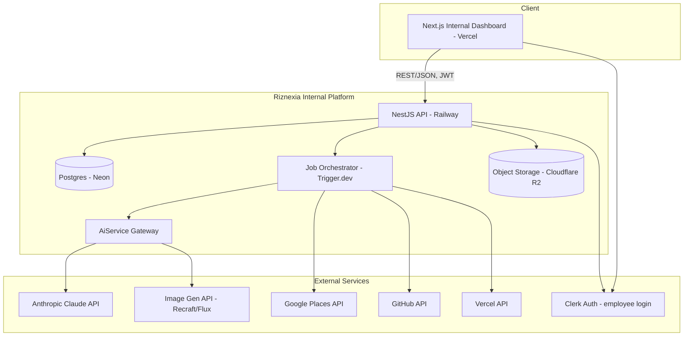
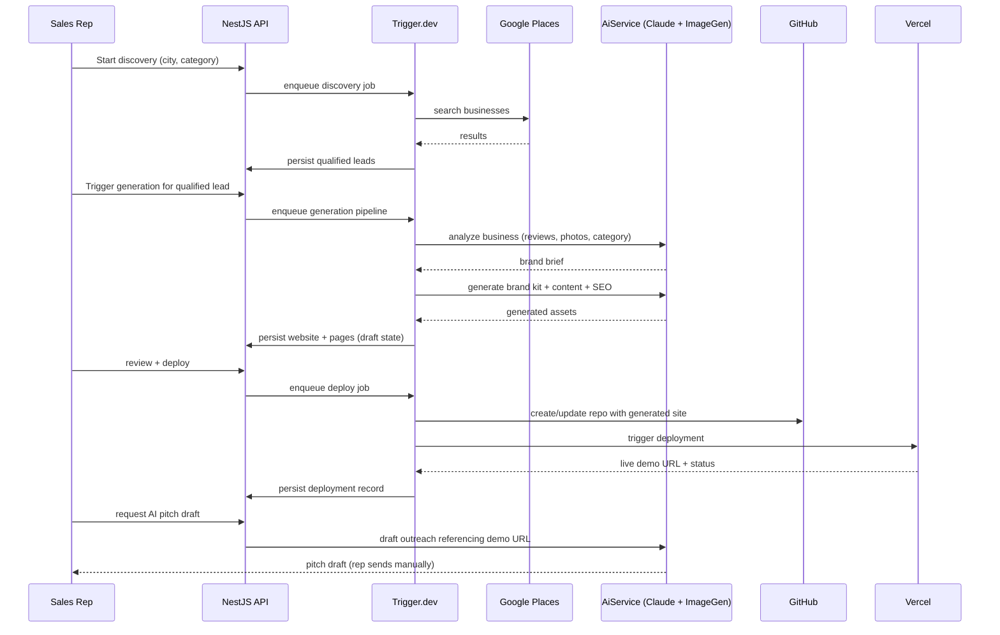

# Technical Architecture — Riznexia AI Sales Platform

**Status:** Draft (revised — internal-tool scope)
**Last updated:** 2026-07-27

> **Scope change note:** Single-organization internal tool. No multi-tenancy, no billing integration, no client-facing deployment ownership ambiguity — demo sites are always Riznexia-owned.

## 1. Architecture Principles

- Favor managed services over self-hosted infrastructure — small internal team, speed matters more than owning every layer.
- Keep AI provider access behind one internal seam (`AiService`) so model/provider swaps are config changes.
- Treat the generation pipeline as a durable, resumable async workflow — steps fail independently and must retry without redoing prior work.
- **Single organization, role-based access.** There is no tenant concept — every user is a Riznexia employee, differentiated only by role (Admin, Manager, Sales Rep).
- Generated demo sites are a build artifact/output of the platform, architecturally separate from the platform's own codebase, and always deployed under Riznexia's own GitHub/Vercel accounts.

## 2. System Overview

Note: no billing/Stripe component exists in this system — there is nothing to bill.

## 3. Core Components

| Component | Technology | Responsibility |
|---|---|---|
| Internal Dashboard | Next.js (App Router), Vercel | Employee-facing UI: pipeline, generation, preview, deployment status |
| API | NestJS, Railway | Business logic, auth guards, role enforcement, orchestration triggers |
| AiService Gateway | NestJS module | Single seam for all LLM/image-gen calls; prompt versioning, provider abstraction |
| Job Orchestrator | Trigger.dev | Durable multi-step workflows: discovery, generation, deployment pipelines |
| Database | Postgres (Neon) | System of record |
| Object Storage | Cloudflare R2 | Generated images/logos/site assets |
| Auth | Clerk | Employee login only; single internal org, roles via custom claims/DB |

## 4. Core Data Flow: Lead-to-Live-Demo Pipeline

Every step is an independently retryable Trigger.dev task — a failed deploy call retries only that step.

## 5. Access Control Model (replaces multi-tenancy)

- **No tenant concept.** All data belongs to Riznexia; there is no `agency_id`/tenant scoping anywhere in the schema.
- Clerk handles employee login, restricted to Riznexia's email domain (invite-only, no public sign-up).
- Roles (`admin`, `manager`, `sales_rep`) are stored on an internal `team_member` table and enforced via NestJS guards: e.g., only Admin/Manager can manage team accounts or view cost dashboards; any rep can run discovery/generation/deployment on their own or unassigned leads.
- Leads carry an `assigned_to` field (optional) rather than tenant ownership — visibility is org-wide by default (any rep can see any lead), with assignment used for accountability, not access restriction (Managers may later restrict this if needed, not an MVP requirement).

## 6. Demo Deployment Ownership

**Decision:** All generated demo sites deploy under **Riznexia-owned** GitHub and Vercel accounts, always. There is no ambiguity here since there is no external agency customer — this is simply how the tool operates. Each generated site gets its own repo (`riznexia-demos/{lead-slug}`) and its own Vercel project, tagged by lead ID for cost tracking and cleanup. Demo sites are explicitly **demo/pitch collateral**, not a production hosting commitment to the business being pitched — if a deal closes and a permanent handoff is required, that is a manual, out-of-system process (explicitly out of MVP scope, no "Public Website Builder" hand-off flow exists).

## 7. AI Provider Architecture (summary — full detail in Doc 9)

- **Text/reasoning:** Anthropic Claude (Sonnet 5 default, Opus 5 for complex cases) via the `AiService` gateway.
- **Images (logo direction, hero imagery):** Recraft or Flux (via Replicate), swappable behind the same gateway.
- All AI calls log token/cost metadata for the internal cost dashboard (BRD BR-7).

## 8. Scalability Considerations

- Neon Postgres scales vertically; no sharding needed at internal-team scale.
- Trigger.dev handles job concurrency/backpressure across reps running discovery/generation concurrently.
- Each demo site is its own Vercel project — no shared bottleneck as demo volume grows.

## 9. Key Architecture Decisions (ADR Summary)

| Decision | Choice | Alternative considered | Why |
|---|---|---|---|
| Monorepo tool | Turborepo + pnpm | Nx | Simpler mental model, excellent Next.js/Vercel integration |
| Backend framework | NestJS | Express/Fastify raw | Structure, DI, guards for role enforcement |
| Job orchestration | Trigger.dev | Hand-rolled BullMQ + Redis | Durable execution, retries, observability without owning queue infra |
| Database | Neon Postgres | Supabase, RDS | Serverless branching fits preview-env workflow; no unneeded auth/storage bundling |
| Auth | Clerk | Auth.js self-rolled | Fast, secure employee auth; domain-restricted invite-only sign-up out of the box |
| AI provider | Anthropic Claude (+ separate image API) | OpenAI, multi-provider from day one | Strong reasoning quality; single-vendor simplicity, gateway seam keeps swap cost low |
| Billing | **None — not applicable** | — | No external customers to bill |

## 10. Resolved Decisions (previously open)

- **Internal API cost ceiling:** Set at **$300/month** as a starting policy (no real usage data existed to measure against), enforced as a hard stop with alerting at 80% utilization. Revisit once Phase 6 produces real per-demo cost data — this is a placeholder, not a permanent figure.
- **Lead visibility:** Confirmed **org-wide** — any authenticated employee can see any lead regardless of assignment (Technical Architecture §5). Revisit only if Riznexia's sales org structure later requires per-rep/team partitioning.

---
**Proceeding to Document 5 (Monorepo Structure).**
