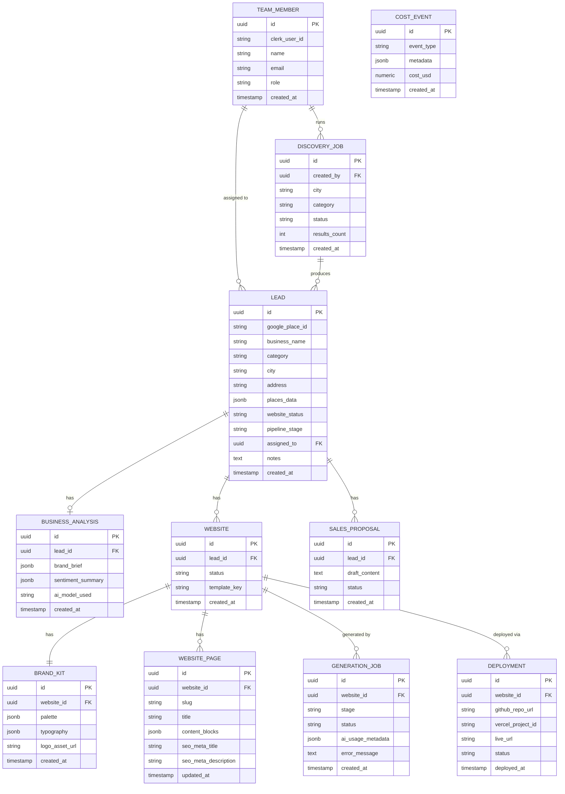

# Database Design — Riznexia AI Sales Platform

**Status:** Draft (revised — internal-tool scope)
**Last updated:** 2026-07-27

> **Scope change note:** No `agency`/tenant tables, no `client`/portal tables, no `subscription`/billing tables. Websites now attach directly to Leads (demo collateral for a pitch, not a post-sale client deliverable). Replaced `usage_event` (billing ledger) with `cost_event` (internal cost observability only).

## 1. Principles

- Postgres (Neon), accessed via Prisma from `apps/api` only.
- No tenant scoping — single organization, all data is Riznexia's own.
- Soft-delete (`deleted_at`) on leads/websites where accidental loss is costly; hard-delete acceptable for ephemeral job/log tables.
- UUID primary keys throughout.
- Timestamps (`created_at`, `updated_at`) on every table.

## 2. Entity Relationship Diagram

## 3. Table Notes

### `team_member`
Internal Riznexia employee, linked to Clerk via `clerk_user_id`. `role` ∈ {`admin`, `manager`, `sales_rep`}. This is the only "identity" table in the system — there is no external user table at all.

### `discovery_job`
Async discovery pipeline record. `created_by` references the rep who ran the search.

### `lead`
Core discovery output. `google_place_id` unique globally (single org, no per-tenant dedupe needed). `places_data` stores the raw Places payload (reviews, photos, rating) as AI analysis input. `website_status` ∈ {`none`, `outdated`, `present`}. `pipeline_stage` ∈ {`new`, `qualified`, `contacted`, `in_discussion`, `won`, `lost`}. `assigned_to` is optional (org-wide visibility by default, per Technical Architecture §5).

### `business_analysis`
AI-derived brand brief used as generation input. New rows on regeneration (history retained, latest wins for display).

### `website`
**Attaches directly to `lead`**, not to a separate client/portal entity — a website is sales collateral generated for a pitch. A lead can have multiple website rows over time (e.g., regenerated from scratch). `status` ∈ {`draft`, `generating`, `ready_for_review`, `deployed`, `failed`}.

### `brand_kit`, `website_page`
Generated content. `content_blocks` is structured JSON (not raw HTML), consumed by the site-template renderer. There is no separate "editable copy" concept — regeneration (AI Agent Architecture) is the only mutation path (PRD FR-4.8).

### `generation_job`
One row per pipeline stage attempt — mirrors the Trigger.dev step, enabling per-stage retry visibility and AI cost attribution.

### `deployment`
One row per deploy attempt; latest successful row's `live_url`/`status` surfaces on the dashboard.

### `sales_proposal`
AI-drafted outreach content tied to a lead. `status` ∈ {`draft`, `edited`, `sent_manually`} — the system never sends on the rep's behalf (PRD FR-8.2).

### `cost_event`
Internal cost observability ledger (Google Places calls, AI token spend, hosting) — **not a billing ledger**, there is no customer to invoice. Feeds the admin cost dashboard (PRD FR-7.4) and BRD BR-7.

## 4. Access Control at the Data Layer

No tenant scoping is needed (single org). Role checks (Admin/Manager/Sales Rep) are enforced in the NestJS service/guard layer, not via row-level data partitioning — e.g., a Sales Rep can read/write any lead, but only Admin/Manager can access `cost_event` rollups or modify `team_member` roles.

## 5. Indexing Notes

- `lead(pipeline_stage)`, `lead(assigned_to)` — pipeline list/filter views.
- `lead(google_place_id)` unique — dedupe on re-discovery.
- `website(lead_id)`, `deployment(website_id, deployed_at desc)` — dashboard status queries.
- `cost_event(created_at)` — cost dashboard rollups.

---
**Proceeding to Document 7 (API Specifications).**
