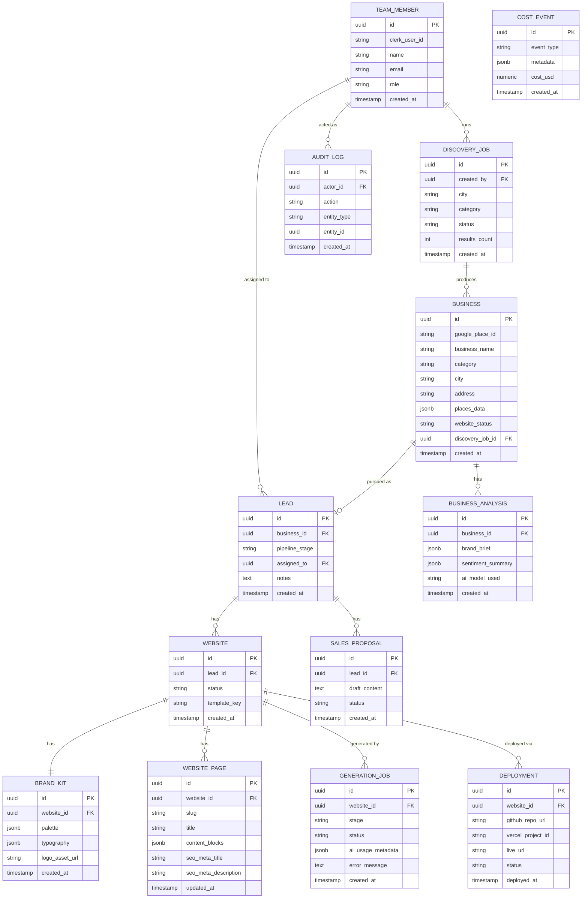

# Database Design — Riznexia AI Sales Platform

**Status:** Draft (revised — internal-tool scope)
**Last updated:** 2026-07-29

> **Scope change note:** No `agency`/tenant tables, no `client`/portal tables, no `subscription`/billing tables. Websites now attach directly to Leads (demo collateral for a pitch, not a post-sale client deliverable). Replaced `usage_event` (billing ledger) with `cost_event` (internal cost observability only).
>
> **Doc-sync note (2026-07-29):** Module M2 split business/Places data off `lead` into a new `business` entity — `lead` now holds pipeline state only. Module M3 replaced the three-role model with six roles and added structural soft-delete enforcement. This document is the summary view; `docs/18-database-architecture.md` carries the authoritative, implementation-exact detail (full Prisma schema). See DECISIONS.md D-018, D-019, D-024, D-029.

## 1. Principles

- Postgres (Neon), accessed via Prisma from `apps/api` only.
- No tenant scoping — single organization, all data is Riznexia's own.
- Soft-delete (`deleted_at`) on `team_member`/`business`/`lead`/`website` where accidental loss is costly, structurally enforced via a Prisma Client Extension (Module M2, not just convention — Database Architecture §7); hard-delete acceptable for ephemeral job/log tables.
- UUID primary keys throughout.
- Timestamps (`created_at`, `updated_at`) on every table.

## 2. Entity Relationship Diagram

## 3. Table Notes

### `team_member`

Internal Riznexia employee, linked to Clerk via `clerk_user_id`. `role` ∈ {`super_admin`, `admin`, `sales_manager`, `developer`, `sales_executive`, `viewer`} (Module M3). This is the only "identity" table in the system — there is no external user table at all.

### `discovery_job`

Async discovery pipeline record. `created_by` references the rep who ran the search.

### `business` _(Module M2)_

Core discovery output — the real-world business and what's known about its web presence, independent of whether Riznexia is actively pursuing it. `google_place_id` unique globally (single org, no per-tenant dedupe needed). `places_data` stores the raw Places payload (reviews, photos, rating) as AI analysis input. `website_status` ∈ {`none`, `outdated`, `present`}. A business that's found but never qualifies for pursuit (e.g. already has a good website) is still recorded here without implying a sales pursuit exists.

### `lead`

Riznexia's pursuit of a `business` — pure pipeline state, one-to-one with its `business` row via a unique `business_id` FK. `pipeline_stage` ∈ {`new`, `qualified`, `contacted`, `in_discussion`, `won`, `lost`}. `assigned_to` is optional (org-wide visibility by default, per Technical Architecture §5). Created only when a discovered business qualifies (none/outdated website) — a `present` business never gets a `lead` row.

### `business_analysis`

AI-derived brand brief used as generation input, keyed to `business_id` (Module M2 — previously `lead_id`). New rows on regeneration (history retained, latest wins for display).

### `website`

**Attaches directly to `lead`**, not to a separate client/portal entity — a website is sales collateral generated for a pitch. A lead can have multiple website rows over time (e.g., regenerated from scratch). `status` ∈ {`draft`, `generating`, `ready_for_review`, `deployed`, `failed`}.

### `brand_kit`, `website_page`

Generated content. `content_blocks` is structured JSON (not raw HTML), consumed by the site-template renderer. There is no separate "editable copy" concept — regeneration (AI Agent Architecture) is the only mutation path (PRD FR-4.8).

### `generation_job`

One row per pipeline stage attempt — mirrors the Trigger.dev step, enabling per-stage retry visibility and AI cost attribution.

### `deployment`

One row per deploy attempt; latest successful row's `live_url`/`status` surfaces on the dashboard.

### `sales_proposal`

AI-drafted outreach content tied to a lead. `status` ∈ {`draft`, `edited`, `sent_manually`} — the system never sends on the rep's behalf (PRD FR-8.2).

### `cost_event`

Internal cost observability ledger (Google Places calls, AI token spend, hosting) — **not a billing ledger**, there is no customer to invoice. Feeds the cost dashboard (`cost:view` permission, PRD FR-7.4) and BRD BR-7.

### `audit_log` _(write path built in Module M3)_

Append-only accountability trail: `actor_id` (nullable, `SET NULL` on employee deletion — history must survive offboarding), `action`, `entity_type`/`entity_id`, `metadata`, `ip_address`, `created_at`. Written by `AuditLogService` for any route explicitly marked as a privileged action (opt-in, not automatic) — see Database Architecture §6 for exactly what is and isn't captured today.

## 4. Access Control at the Data Layer

No tenant scoping is needed (single org). Role/permission checks (Module M3 — `super_admin`, `admin`, `sales_manager`, `developer`, `sales_executive`, `viewer`, each with an explicit permission set) are enforced in the NestJS guard layer, not via row-level data partitioning — e.g., any role with `leads:read` can read any lead, but only the roles holding `team:manage`/`cost:view` (Super Admin/Admin/Sales Manager) can access `cost_event` rollups or modify `team_member` roles.

## 5. Indexing Notes

- `lead(pipeline_stage)`, `lead(assigned_to)` — pipeline list/filter views.
- `business(google_place_id)` unique — dedupe on re-discovery (moved from `lead`, Module M2).
- `business(city)`, `business(category)`, `business(business_name)` — pipeline/lead-list filter and search views.
- `website(lead_id)`, `deployment(website_id, deployed_at desc)` — dashboard status queries.
- `cost_event(created_at)` — cost dashboard rollups.
- `audit_log(entity_type, entity_id)`, `audit_log(actor_id, created_at desc)` — "show history for this record" / "show this employee's activity."

---

**Proceeding to Document 7 (API Specifications).**
