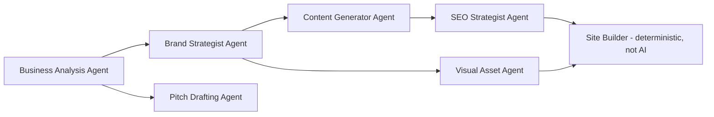

# AI Agent Architecture — Riznexia AI Sales Platform

**Status:** Draft (revised — internal-tool scope)
**Last updated:** 2026-07-27

> **Scope change note:** Pipeline and agent design are largely unchanged from the original architecture — this was already designed as generation-for-a-specific-business, which maps directly onto "generate a demo for a lead." Key changes: generation is gated behind a "Qualified" pipeline stage (cost control), and the Sales Agent now explicitly serves an internal Riznexia rep rather than an "agency."

## 1. Design Goals

- **Grounded, not generic.** Every generation step consumes real business data (Places data, reviews, photos, category).
- **One gateway, many stages.** All model calls go through a single `AiService` (in `packages/ai`), centralizing cost tracking, retries, and provider swaps.
- **Durable, observable pipeline.** Each stage is a Trigger.dev task, individually retryable, status persisted to `generation_job` rows.
- **Human-in-the-loop by default.** No demo reaches a "pitch-ready" state without a rep reviewing the live preview first (PRD FR-5.1).
- **Gated by qualification.** Generation only runs for leads at "Qualified" pipeline stage or later (BRD risk mitigation — prevents indiscriminate AI spend, PRD FR-4.1).

## 2. Pipeline Stages

| Stage | Agent | Model | Input | Output |
|---|---|---|---|---|
| 1 | Business Analysis | Claude Sonnet 5 | Places data: reviews, rating, category, photos metadata | Structured brand brief: tone, audience signals, strengths, sentiment summary |
| 2 | Brand Strategist | Claude Sonnet 5 | Brand brief | Palette (hex tokens), typography pairing, logo concept/direction (text description) |
| 3 | Content Generator | Claude Sonnet 5 (Opus 5 fallback on low-confidence/retry) | Brand brief + brand kit + category template's page schema | Per-page structured content blocks |
| 4 | Visual Asset | Recraft / Flux (via Replicate) | Logo concept from stage 2 | Logo image asset(s), stored in R2 |
| 5 | SEO Strategist | Claude Sonnet 5 | Generated page content | Meta titles/descriptions, heading structure, sitemap entries |
| 6 | Site Builder | Deterministic (no AI) | Brand kit + page content + category template | Rendered site files, pushed to the demo's repo |
| — | Pitch Drafting | Claude Sonnet 5 | Brand brief + live demo URL (if deployed) | Drafted outreach/pitch text for the rep to review and send manually |

Stage 6 is intentionally not an AI step — templates are deterministic React components; AI only supplies content/tokens.

## 3. Model Selection Policy

- **Default:** Claude Sonnet 5 for all reasoning/content stages.
- **Escalation:** If a stage's output fails validation twice, retry once on Claude Opus 5 before surfacing a failure to the rep.
- **Images:** kept on a separate provider by design, swappable behind the gateway.

## 4. Prompt Management

- Prompts live as versioned templates in `packages/ai/prompts/`, each with a semantic version; `generation_job.ai_usage_metadata` records which prompt version produced a given output.
- Business data is injected via clearly delimited structured sections to reduce prompt-injection risk from adversarial input (e.g., a manipulated Google review).

## 5. Output Validation & Guardrails

- Every AI response is parsed against a zod schema before being persisted — malformed output fails the stage and triggers a retry.
- Content-level checks: required fields present, no placeholder leakage, profanity/safety filter pass, minimum content length.
- Brand kit checks: generated palette validated for WCAG AA contrast before being marked usable; a failing palette triggers automatic regeneration.
- Validation is a pre-filter, not a substitute for the rep reviewing the live preview before pitching (§1).

## 6. Cost Governance

- Every AI call logs token counts and computed `cost_usd` to `generation_job.ai_usage_metadata`, rolled up into `cost_event` (Database Design §3) for the internal cost dashboard (API Specifications §3 `/cost/summary`).
- Per-rep and global daily spend ceilings enforced in `AiService` itself, not just at the API rate-limit layer — a last-line guard against runaway cost. Global ceiling initialized at **$300/month** (org-wide, covering Places + AI text + image gen), alerting at 80% utilization; treated as a starting policy to be revised once real per-demo cost data exists (Technical Architecture §10).
- Generation is only invocable on Qualified+ leads (§1), which is itself a cost-governance control, not just a workflow rule.

## 7. AI-Specific Risks & Mitigations

| Risk | Mitigation |
|---|---|
| Hallucinated business facts (wrong hours, services not offered) | Generation constrained to assert only facts present in input data; prompts explicitly instruct against inventing specifics |
| Prompt injection via review text or business name | Structured input delimiting (§4); output validated against schema, never executed |
| Runaway cost from retry loops or indiscriminate generation | Bounded escalation policy (§3), qualification gate (§1), per-rep/global spend ceilings (§6) |
| Low-quality demo used in a live pitch | Mandatory rep review before pitching (§1, PRD FR-5.1), automated validation as pre-filter (§5) |

---
**Proceeding to Document 10 (Development Roadmap).**
