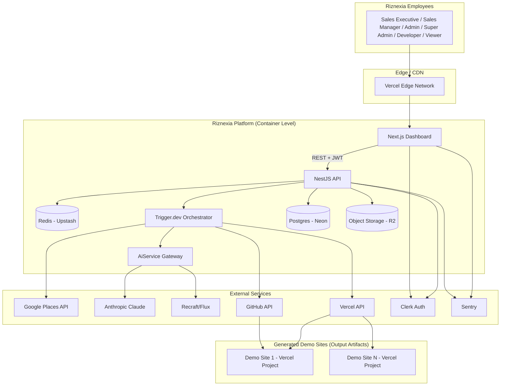
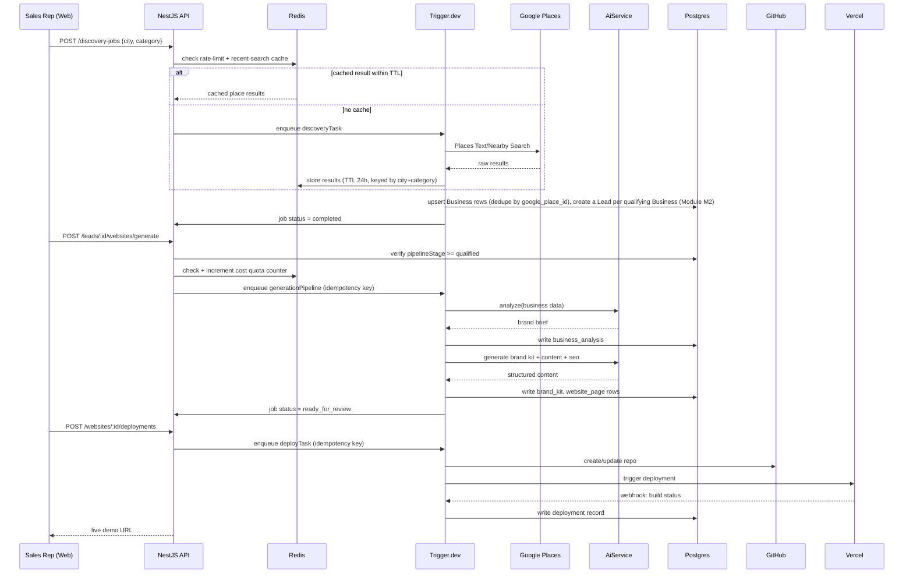
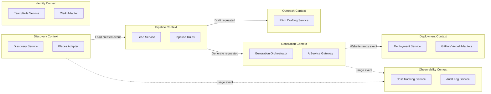
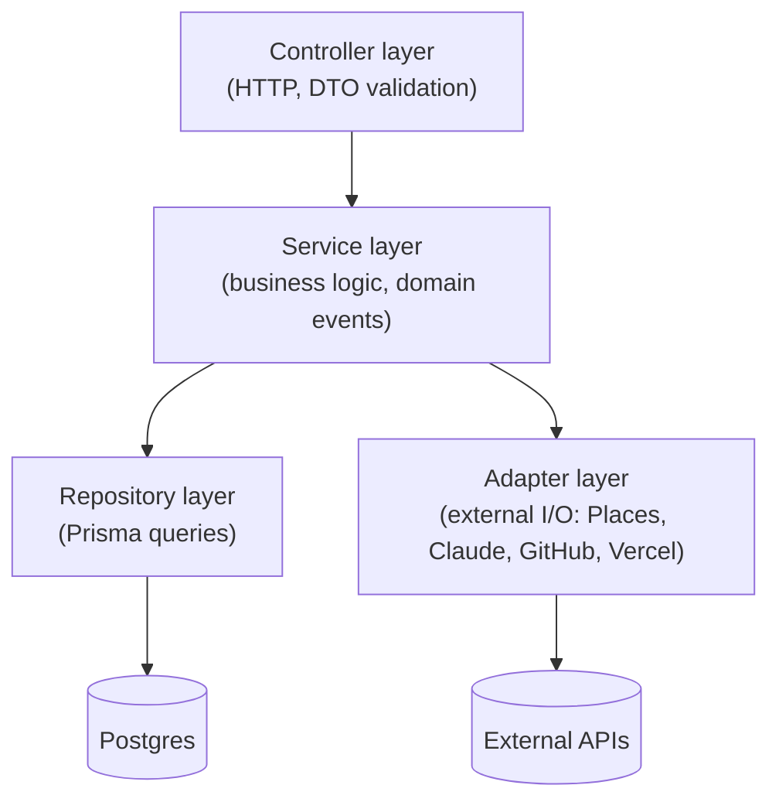
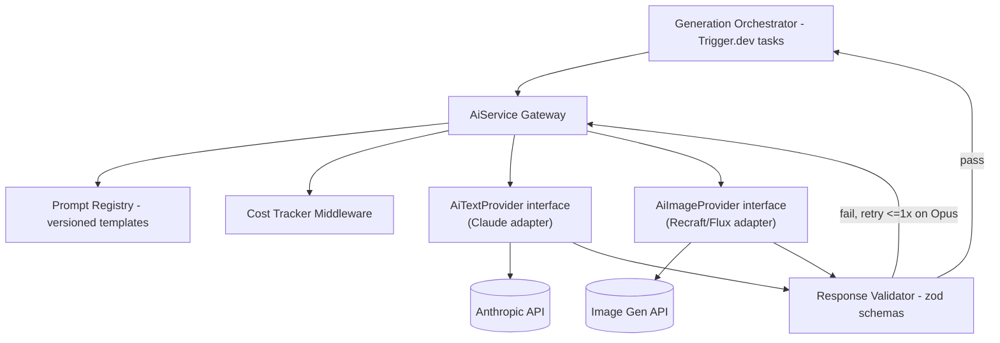
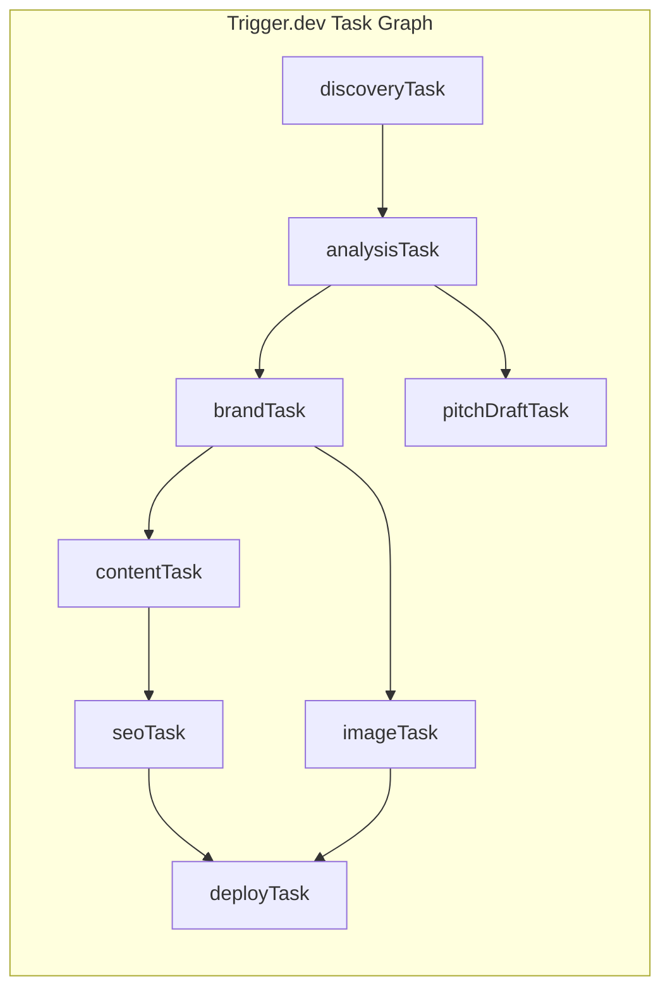
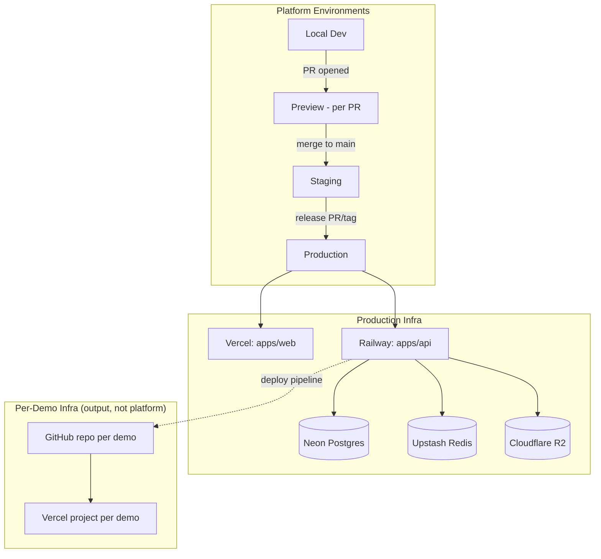
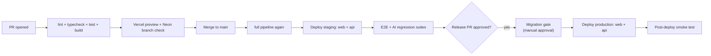

# System Architecture — Riznexia AI Sales Platform

**Status:** Draft — Phase 2 deliverable (deep technical design)
**Role:** Principal Software Architect pass
**Last updated:** 2026-07-29

> **Scope carried forward:** Internal-only tool for Riznexia employees (per the approved scope pivot). Single organization, RBAC-based access, no billing, no client portal, no editing UI. This document deepens and consolidates the summary-level design in Docs 04/05/06/07/09/15 into a full system architecture — it does not contradict them, it extends them to implementation-ready depth.
>
> **Terminology note:** The user's phase list used "Phase 2+" for future integrations. Since "Phase 2" is already our roadmap's System Design phase, this document labels deferred work **"Post-MVP"** instead, to avoid collision. No application/implementation code is included anywhere below, per instruction.
>
> **Doc-sync note (2026-07-29):** Updated against the implemented architecture through Module M3: the six-role RBAC model (§1), the Discovery/Pipeline bounded-context split following Module M2's `Business`/`Lead` entity split (§3), the extended guard chain and security request chain (§6, §15), the real `common/rbac`/`common/audit`/`business` folders (§17), and the `Organization` future model that now concretely exists as commented-out schema (§20, replacing the vaguer prior "agency_id" framing). See DECISIONS.md D-018, D-023–D-028, D-029.

---

## 1. High-Level Architecture



**Reading this diagram:** everything inside "Platform" is one logical system (a modular monolith, not microservices — see §3 for why). "Generated Demo Sites" are build _outputs_ of the platform, structurally outside it. External services are the only systems we don't control.

## 2. Low-Level Architecture

Full sequence for the core pipeline, including cache and queue interaction points omitted from the Phase 1 summary diagram:



## 3. Service Boundaries

The platform is built as a **modular monolith**: one deployable NestJS process, but internally partitioned into strict bounded contexts so any module could be extracted into its own service later without a rewrite (see §19 Scalability).



| Context       | Owns                                                                                                                       | Never reaches into                                        |
| ------------- | -------------------------------------------------------------------------------------------------------------------------- | --------------------------------------------------------- |
| Discovery     | `discovery_job`, `business` (raw Places data + web-presence status — split out of `lead` in Module M2, DECISIONS.md D-018) | Generation internals                                      |
| Pipeline      | `lead` (pure pipeline state as of Module M2: stage, assignment, notes — no business data)                                  | AI provider details                                       |
| Generation    | `website`, `brand_kit`, `website_page`, `generation_job`                                                                   | Deployment mechanics                                      |
| Deployment    | `deployment`, GitHub/Vercel calls                                                                                          | Content generation logic                                  |
| Outreach      | `sales_proposal`                                                                                                           | Deployment mechanics                                      |
| Identity      | `team_member`, roles, role hierarchy + permission matrix (Module M3)                                                       | Domain data (leads/websites)                              |
| Observability | `cost_event`, audit logs                                                                                                   | Writes to any domain table — read-only + event-subscriber |

Cross-context communication happens via **domain events** (NestJS `EventEmitter2`, in-process pub/sub — see §18 Design Patterns), not direct service-to-service method calls across boundaries. This is the seam that makes future extraction to real microservices/queues a swap of the event transport, not a redesign.

## 4. Monorepo Structure

Extends Doc 05 with the packages this deeper design introduces:

```
riznexia-ai-website-factory/
├── apps/
│   ├── web/                  # Next.js dashboard
│   ├── api/                  # NestJS API (all 7 bounded contexts as modules)
│   └── site-template/        # Demo site scaffold
├── packages/
│   ├── ui/                   # Dashboard component library
│   ├── shared-types/         # Cross-app contracts (zod + TS types)
│   ├── ai/                   # AiService: providers, prompts, validators
│   ├── db/                   # Prisma schema + migrations
│   ├── cache/                # Redis client wrapper (NEW — §10)
│   ├── logger/                # Structured logging wrapper (NEW — §14)
│   ├── config-eslint/
│   └── config-typescript/
├── docs/
├── .github/workflows/
├── turbo.json
├── pnpm-workspace.yaml
└── package.json
```

`packages/cache` and `packages/logger` are new relative to Doc 05 — both are cross-cutting infrastructure, not domain logic, so they're separated the same way `packages/ai` and `packages/db` are.

## 5. Frontend Architecture

- **Rendering model:** Next.js App Router, server components by default. Data that doesn't change per-interaction (lead lists, static config) is server-fetched; live status (generation progress, deployment status) is client-fetched via TanStack Query with a polling interval, not a persistent connection — see §20 for the SSE/WebSocket upgrade path.
- **State layering:**
  - Server state → TanStack Query (cached, revalidated, polling for async job status)
  - UI-local state → React state/hooks (form inputs, drawer open/closed)
  - No global client state store (Redux/Zustand) — not justified at this app's complexity; server state via TanStack Query covers the real need.
- **Route map** (mirrors resources, per Doc 12 §3):
  ```
  /                          dashboard home
  /discovery                 search + job history
  /leads                     pipeline list/kanban
  /leads/[id]                lead detail (analysis, generation, proposals)
  /leads/[id]/websites/[id]  generation review + deployment status
  /team                      team:manage permission (Super Admin/Admin/Sales Manager): team management
  /cost                      cost:view permission (Super Admin/Admin/Sales Manager): cost dashboard
  ```
- **Component layering:** `packages/ui` primitives (button, table, badge) → composed feature components (colocated per route, e.g., `PipelineKanban`) → pages. No premature promotion of page-specific components into the shared package.

## 6. Backend Architecture

Layered, per NestJS convention, strictly enforced (Doc 12 §2):



**Cross-cutting concerns**, applied globally, not per-handler:

- **Guards (Module M3):** JWT validation (Clerk) → role resolution → exact-role-list check (`RolesGuard`) → role-hierarchy check (`MinRoleGuard`) → fine-grained permission check (`PermissionsGuard`). Each of the three role/permission guards is a no-op unless its decorator (`@Roles()`/`@MinRole()`/`@RequirePermissions()`) is present on the route (DECISIONS.md D-025, D-026).
- **Interceptors:** request/response logging (correlation ID injection — §14), response envelope shaping, plus `AuditLogInterceptor` (Module M3) — records a privileged action to `audit_log` on success for any route carrying `@Audited()`; no-op otherwise.
- **Pipes:** zod-backed validation on every DTO.
- **Exception filters:** map typed domain exceptions to the standard error envelope (Doc 07 §1).
- **Domain events:** `EventEmitter2` used for in-process pub/sub across bounded contexts (§3) — e.g., `WebsiteGeneratedEvent` triggers cost-logging and lead-pipeline-stage suggestions without the Generation context importing the Observability or Pipeline context directly.

## 7. AI Layer



This is the implementation-depth view of Doc 09: every call is `Orchestrator → Gateway → (Registry + CostTracker) → Provider adapter → Validator → back to Orchestrator`. No pipeline stage calls a provider adapter directly — the Gateway is the only entry point, which is what makes provider swaps and cost tracking guaranteed rather than convention-based.

## 8. Database Layer

- Postgres (Neon), schema per Doc 06. Accessed exclusively through `packages/db`'s Prisma client — no other package holds a DB connection.
- **Connection pooling:** Neon's serverless driver (HTTP-based, pool-friendly for serverless/edge) from `apps/api`'s Railway-hosted long-running process uses standard pooled TCP connections; no PgBouncer layer needed at this scale (single backend service, not serverless functions holding many short-lived connections).
- **Migration strategy:** expand/contract (Doc 14 §4), reviewed in the PR that changes the schema.
- **Read replicas:** not provisioned at MVP — flagged as a Post-MVP scaling lever (§19) if the Cost/reporting queries start contending with transactional writes.

## 9. Queue System

Trigger.dev is the durable execution layer for every multi-step, externally-dependent workflow:



- **Retry policy:** exponential backoff, max 3 attempts per task, per-task-type override (e.g., `deployTask` gets a longer backoff given Vercel build times).
- **Concurrency control:** per-task-type concurrency caps (e.g., max 5 concurrent `generationPipeline` runs org-wide) to keep AI/Places spend and Neon connection usage bounded — enforced in Trigger.dev config, not application code.
- **Idempotency:** every task keyed by the `Idempotency-Key` passed from the originating API call (Doc 07 §1) — a retried task is a no-op if its output already exists.
- **Dead-letter handling:** a task that exhausts retries marks its `generation_job`/`deployment` row `failed` (visible to the rep) and emits an alert to the internal ops channel — never fails silently.

## 10. Cache Layer _(new relative to Phase 1 docs)_

**Technology:** Upstash Redis (serverless, pairs naturally with Vercel/Railway — no server to manage).

| Use case                                                                   | Key pattern                          | TTL            |
| -------------------------------------------------------------------------- | ------------------------------------ | -------------- |
| Rate limiting (per-rep, global)                                            | `ratelimit:{scope}:{repId}:{window}` | rolling window |
| Cost-quota counters                                                        | `cost:monthly:{scope}`               | resets monthly |
| Discovery result caching (avoid duplicate Places spend on repeat searches) | `discovery:{city}:{category}`        | 24h            |
| Idempotency-key result cache (fast-path repeat requests)                   | `idem:{key}`                         | 1h             |

This is **not** a general HTTP response cache — Next.js/Vercel's own caching covers that layer for the dashboard. Redis here exists specifically to make cost governance (§ BR-7 in the BRD) and duplicate-work avoidance cheap and centralized, rather than reimplemented per endpoint.

## 11. Storage Layer

Cloudflare R2, namespaced and access-controlled:

- **Key convention:** `{website_id}/logo.{ext}`, `{website_id}/pages/{page_slug}/{asset}.{ext}` — never a flat/global namespace, and never sequentially guessable (Security Strategy §2).
- **Access pattern:** no public bucket. Assets are served via signed, time-limited URLs generated by the API on demand (dashboard preview) or baked into the generated site's build (public demo assets, which _are_ meant to be public once deployed — the distinction is: R2 access during generation/review is signed, but assets bundled into a deployed demo site are public by definition, same as any live website's images).
- **Lifecycle:** assets tied to a `website_id`; soft-deleted alongside the website record, hard-purged on the same retention schedule (Security Strategy §7).

## 12. Deployment Architecture



Two independent deployment lifecycles: the **platform** (this section) follows the standard CI/CD promotion path (§16); **generated demo sites** are created/redeployed on-demand by the platform itself as a product feature, entirely outside this pipeline.

## 13. Monitoring _(new relative to Phase 1 docs)_

| Layer                  | Tool                                                                                     | What it covers                                         |
| ---------------------- | ---------------------------------------------------------------------------------------- | ------------------------------------------------------ |
| Application errors     | Sentry (frontend + backend)                                                              | Unhandled exceptions, stack traces, release tracking   |
| Infra health           | Vercel / Railway built-in metrics                                                        | CPU/memory, request latency, deploy status             |
| Pipeline observability | Trigger.dev dashboard                                                                    | Task success/failure rates, retry counts, duration     |
| Business metrics       | Internal `/cost` dashboard + a lightweight ops dashboard                                 | Demos generated/week, cost per demo, quota utilization |
| Uptime                 | A simple scheduled healthcheck hitting `/health` (Better Uptime or equivalent free tier) | Platform availability                                  |

Alert routing: Sentry + healthcheck failures → Slack/email (Deployment Strategy §8), cost-ceiling-approaching (§10) → Slack, same channel as deploy failures to keep ops signal in one place for a small team.

## 14. Logging _(new relative to Phase 1 docs)_

- **Format:** structured JSON logging (Pino, via `packages/logger`) — never unstructured `console.log` in `apps/api`.
- **Correlation:** every request gets a correlation ID (generated at the edge or propagated from an existing header), attached to every log line and to the `generation_job`/`deployment` row it produces — so a failure can be traced end-to-end across the async pipeline, not just within a single request.
- **Levels:** `error` (paged), `warn` (reviewed), `info` (business events: job started/completed), `debug` (local/staging only, never enabled in production by default).
- **No secrets/PII in logs** — enforced by a lint rule around logger calls plus code review; AI prompts/responses are logged at `debug` only, redacted of anything beyond what's needed to diagnose (Security Strategy §3, §7).
- **Aggregation:** Railway's native log stream is sufficient at this scale; revisit a dedicated aggregator (Axiom/Logtail) only if search/retention needs outgrow it (Post-MVP, §20).

## 15. Security

Full policy lives in Doc 15; this section places it architecturally:

```mermaid
flowchart LR
    Req[Incoming Request] --> TLS[TLS termination - Vercel/Railway]
    TLS --> AuthGuard["ClerkAuthGuard\n(Clerk JWT validation)"]
    AuthGuard --> RoleGuard["RolesGuard\n(exact role-list check)"]
    RoleGuard --> MinRoleGuard["MinRoleGuard\n(role-hierarchy check)"]
    MinRoleGuard --> PermGuard["PermissionsGuard\n(fine-grained permission check)"]
    PermGuard --> Pipe["ValidationPipe\n(zod schema)"]
    Pipe --> Handler[Controller Handler]
    Handler --> AuditInt["AuditLogInterceptor\n(records @Audited() actions on success)"]
    AuditInt --> Filter["ExceptionFilter\n(typed errors -> envelope)"]
```



Every request passes through this exact chain — there is no endpoint that skips `ClerkAuthGuard` except the explicitly public, signature-verified webhook routes (Doc 07 §3). `RolesGuard`/`MinRoleGuard`/`PermissionsGuard` (Module M3, DECISIONS.md D-023–D-026) are each a no-op unless their respective decorator is present on the route — most routes today carry none of the three and are gated on authentication alone.

## 16. CI/CD



Matches Deployment Strategy §3 exactly — this diagram is the visual form of that section, included here for completeness of the architecture picture.

## 17. Folder Structure

```
apps/api/src/
├── auth/                          # Clerk integration, TeamMemberService, GET /me (built)
├── discovery/                     # built (Module M1) — actual shape below
│   ├── discovery.controller.ts
│   ├── discovery.service.ts
│   ├── discovery-runner.service.ts  # pipeline logic; in-process dispatch today, DECISIONS.md D-004
│   ├── discovery.module.ts
│   └── dto/
├── leads/                         # built (Modules M1–M2)
│   ├── leads.controller.ts
│   ├── leads.service.ts
│   ├── lead.mapper.ts
│   ├── leads.module.ts
│   └── dto/
├── business/                      # built (Module M2) — not in the original plan; see DECISIONS.md D-018
│   ├── business.service.ts
│   ├── business.mapper.ts
│   └── business.module.ts
├── generation/                    # not built — planned shape unchanged
│   ├── generation.controller.ts
│   ├── generation.service.ts
│   ├── generation.tasks.ts
│   ├── generation.module.ts
│   └── dto/
├── deployment/                    # not built — same shape as generation/
├── pitch/                         # not built — same shape as generation/
├── team/                          # not built — same shape as generation/ (Backlog item, docs/21 §5)
├── common/
│   ├── guards/                    # ClerkAuthGuard, RolesGuard, MinRoleGuard, PermissionsGuard (Module M3)
│   ├── rbac/                      # role-hierarchy.constants.ts, permission.constants.ts, rbac.module.ts (Module M3)
│   ├── audit/                     # audit-log.service.ts, audit-log.interceptor.ts, audit.module.ts (Module M3)
│   ├── interceptors/              # logging, response shaping
│   ├── filters/                   # exception filter
│   └── decorators/                # @Public(), @Roles(), @MinRole(), @RequirePermissions(), @Audited(), @CurrentUser()
├── adapters/
│   ├── places.adapter.ts          # built (Module M1)
│   ├── website-fetch.adapter.ts   # built (Module M1)
│   ├── github.adapter.ts          # not built
│   └── vercel.adapter.ts          # not built
└── main.ts

apps/web/app/
├── (dashboard)/
│   ├── page.tsx                   # dashboard home
│   ├── discovery/page.tsx
│   ├── leads/
│   │   ├── page.tsx
│   │   └── [id]/page.tsx
│   ├── team/page.tsx
│   └── cost/page.tsx
├── layout.tsx
└── globals.css
```

## 18. Design Patterns

| Pattern                  | Where used                                                 | Why                                                                                                                            |
| ------------------------ | ---------------------------------------------------------- | ------------------------------------------------------------------------------------------------------------------------------ |
| Dependency Injection     | Throughout `apps/api` (NestJS core)                        | Testability, swappable adapters                                                                                                |
| Strategy                 | `AiTextProvider` / `AiImageProvider` interfaces (§7)       | Swap Claude/Recraft/Flux without touching callers                                                                              |
| Adapter                  | `adapters/*.ts` (Places, GitHub, Vercel)                   | Isolate third-party API shape from domain code                                                                                 |
| Repository               | Prisma service layer (§8)                                  | Single choke point for DB access, mockable in tests                                                                            |
| Factory                  | Site template selection by category (`apps/site-template`) | Category → template resolution without conditional sprawl in generation logic                                                  |
| Observer / Domain Events | `EventEmitter2` cross-context communication (§3, §6)       | Decouple bounded contexts; extraction-ready                                                                                    |
| Circuit breaker          | Wrapping Places/Claude/image-gen adapters                  | Prevent cascading failure/cost spend if an external API degrades (fails fast after N consecutive errors, auto half-open retry) |
| Retry with backoff       | Trigger.dev task config (§9)                               | Resilience against transient external failures without custom retry code                                                       |

## 19. Scalability Strategy

- **Stateless API tier:** `apps/api` on Railway scales horizontally (multiple instances) since no in-process state is held — session/role resolution is per-request from Clerk JWT, job state lives in Postgres/Trigger.dev.
- **Async work isolated from request/response cycle:** every expensive operation (discovery, generation, deployment) runs as a Trigger.dev task, so API instances stay cheap and fast regardless of pipeline load.
- **Database:** Neon scales vertically first; read replicas (§8) and/or a dedicated reporting read-path are the next lever if the Cost/Observability context's queries start contending with transactional writes.
- **Per-demo isolation:** each generated site is its own Vercel project — demo volume growing into the thousands (long-term vision) doesn't create a shared bottleneck, since each is independently hosted.
- **Cost-bounded concurrency:** Trigger.dev per-task concurrency caps (§9) are the actual scaling _limiter_ by design — this system intentionally trades raw throughput for cost predictability, appropriate for an internal tool, not a race-to-scale product.

## 20. Future Expansion Plan (Post-MVP)

Designed for, not built now — flagged explicitly so today's architecture doesn't block them later:

| Future capability                           | Why it's deferred                                                     | What today's design already allows                                                                                                                                                                                                                                                       |
| ------------------------------------------- | --------------------------------------------------------------------- | ---------------------------------------------------------------------------------------------------------------------------------------------------------------------------------------------------------------------------------------------------------------------------------------- |
| Real-time pipeline updates (WebSocket/SSE)  | Polling is sufficient at current usage volume                         | TanStack Query polling is a drop-in swap for a subscription-based fetcher later; no rearchitecture needed                                                                                                                                                                                |
| External productization (multi-tenant SaaS) | Explicitly out of current scope (BRD)                                 | `packages/db/prisma/schema.prisma` already has a commented-out `Organization` model and a documented `TeamMember` attachment point (Module M3, DECISIONS.md D-027) — a concrete step beyond the earlier generic "an `agency_id` column would fit" framing, though still inactive/unbuilt |
| Client portal / customer login              | Explicit non-goal                                                     | Auth is cleanly isolated to Clerk + `team_member`; a second, separate auth flow for external users would not touch this one                                                                                                                                                              |
| Billing/subscription                        | Explicit non-goal                                                     | N/A — would be a net-new bounded context, not a retrofit                                                                                                                                                                                                                                 |
| ML-based lead-quality scoring               | Needs real usage data first (heuristic detection is the MVP baseline) | `business_analysis` and `cost_event` data already being collected is exactly the training signal this would need later                                                                                                                                                                   |
| Multi-region deployment                     | Not justified at current team/usage scale                             | Neon and Vercel both support multi-region expansion without a platform rewrite                                                                                                                                                                                                           |
| Dedicated log aggregation (Axiom/Logtail)   | Railway's native logs suffice today                                   | `packages/logger`'s structured JSON output is aggregator-agnostic already                                                                                                                                                                                                                |
| BYO GitHub/Vercel accounts per rep/team     | No external tenant to segment by                                      | Deployment adapters (§18) are already isolated behind an interface; swapping credentials per-context is additive                                                                                                                                                                         |

---

**This document is Phase 2's deep-design deliverable. As of 2026-07-29, Modules M1–M3 (docs/21-implementation-roadmap.md) are implemented against this architecture — see the doc-sync note above for what changed since the original Phase 2 approval.**
