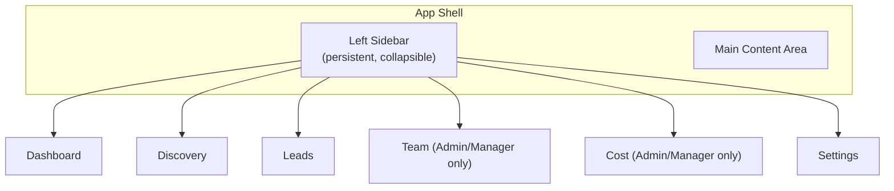
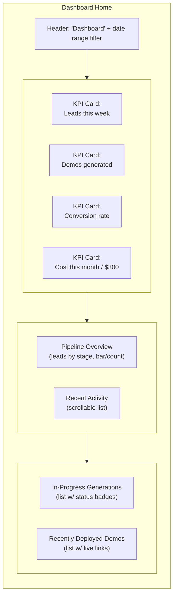
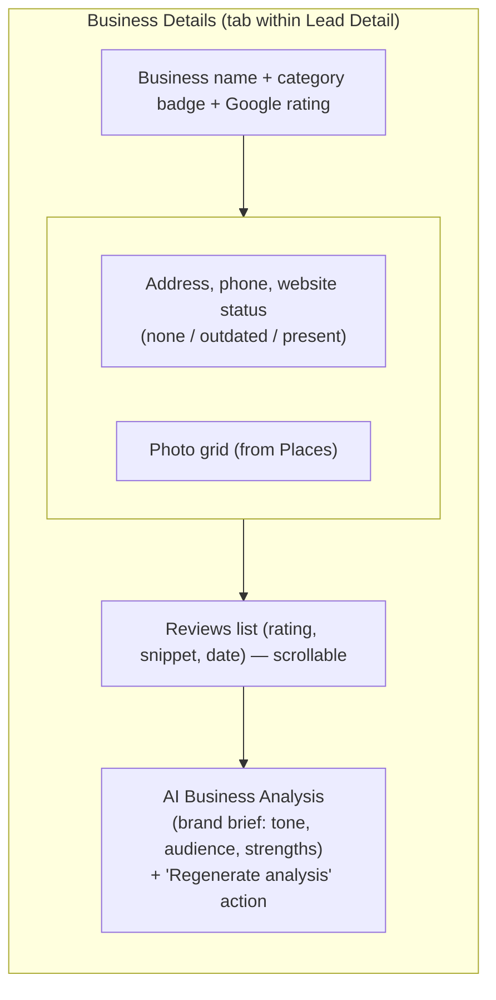
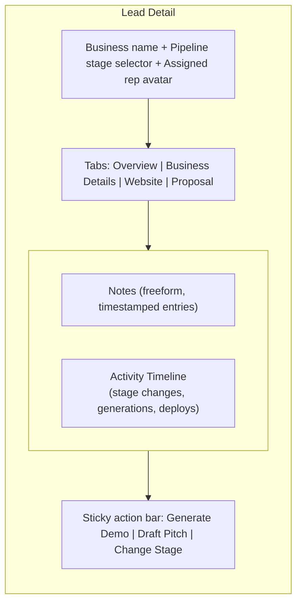
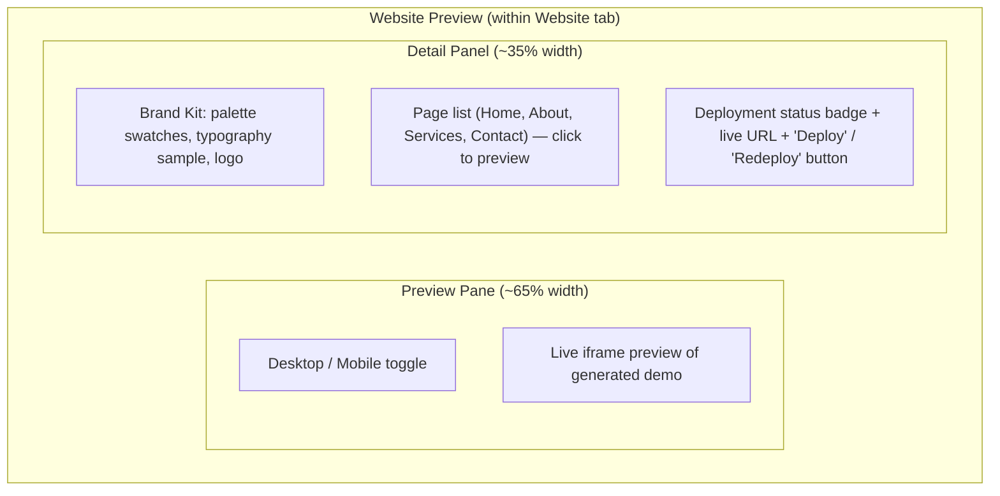
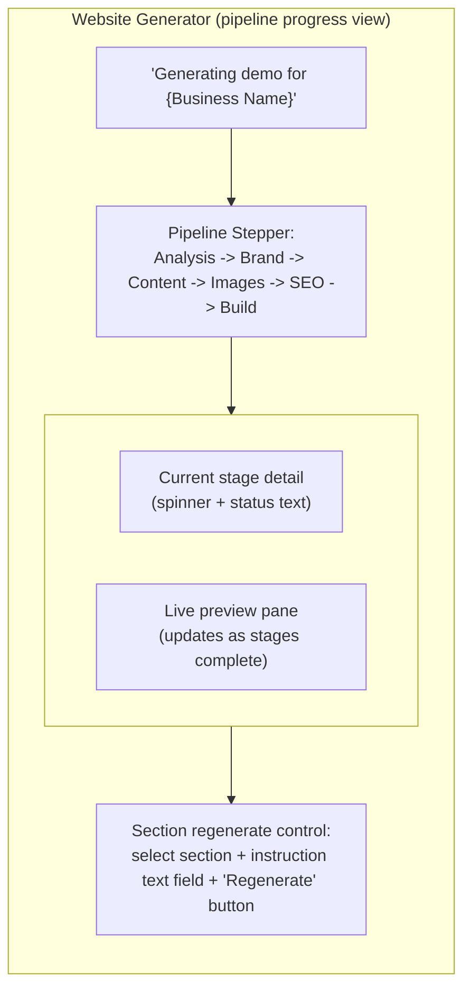
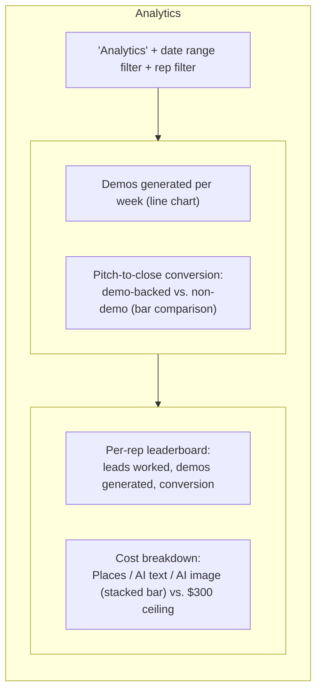
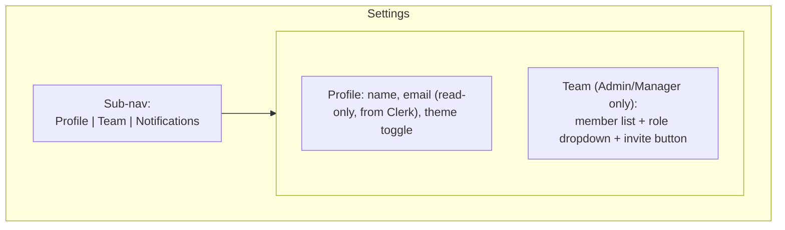

# UI/UX Design — Riznexia AI Sales Platform

**Status:** Draft — Phase 3 deliverable
**Role:** Senior Product Designer pass
**Last updated:** 2026-07-27

> **Scope note:** This document deepens Doc 08 into a full design system + low-fidelity wireframes for every requested screen. Wireframes are structural box diagrams (layout/hierarchy only — no color, no copy polish, no code) per the "wireframes only, no frontend code" instruction. This is an **internal dashboard** for Riznexia employees (per the approved scope pivot) — premium-SaaS visual quality, but no customer-facing surface exists anywhere in this design.

---

## 1. Design System — Principles

- **Operator-density over marketing-polish.** Reps live here daily; every screen optimizes for scanning speed and status legibility over decorative whitespace.
- **Status is never ambiguous.** Discovery, generation, and deployment are async — every screen that touches them shows state (queued/running/failed/done) at a glance.
- **One accent color, used sparingly.** Primary actions and active states only — the interface should read as calm and information-dense, not colorful.
- **No dead ends.** Every generated artifact (brand kit, page copy) is visibly AI-drafted and always has a clear next action (regenerate, deploy, draft pitch).

## 2. Typography

| Token | Font | Size | Weight | Use |
|---|---|---|---|---|
| `text-display` | Inter | 30px / 1.2 | 600 | Page titles (rare — most screens use `text-h1`) |
| `text-h1` | Inter | 24px / 1.3 | 600 | Screen headers |
| `text-h2` | Inter | 18px / 1.4 | 600 | Card/section headers |
| `text-body` | Inter | 14px / 1.5 | 400 | Default UI text |
| `text-body-medium` | Inter | 14px / 1.5 | 500 | Emphasized labels, table headers |
| `text-caption` | Inter | 12px / 1.4 | 400 | Metadata, timestamps, helper text |
| `text-mono` | JetBrains Mono | 13px / 1.5 | 400 | URLs, IDs, code-like values (repo names, API costs) |

Single font family (Inter) for UI text keeps the dense, data-heavy screens calm; monospace is reserved for genuinely code-like values (deployment URLs, place IDs) so they're visually distinct from prose.

## 3. Color Palette

Neutral-first, one accent, semantic status colors — full light/dark pairs (dark is default given daily internal tool usage patterns skew toward it, but both are first-class, not an afterthought).

| Token | Light | Dark | Use |
|---|---|---|---|
| `bg-canvas` | `#FFFFFF` | `#0B0D12` | App background |
| `bg-surface` | `#F8F9FB` | `#12151C` | Cards, panels |
| `bg-surface-raised` | `#FFFFFF` | `#1A1E27` | Modals, dropdowns |
| `border-default` | `#E5E7EB` | `#262B36` | Dividers, card borders |
| `text-primary` | `#111827` | `#F2F3F5` | Primary text |
| `text-secondary` | `#6B7280` | `#9AA1AC` | Secondary/caption text |
| `accent` | `#4F46E5` | `#6366F1` | Primary actions, active nav, links |
| `accent-hover` | `#4338CA` | `#818CF8` | Hover state on accent elements |
| `success` | `#16A34A` | `#4ADE80` | Deployed, completed |
| `warning` | `#D97706` | `#FBBF24` | Needs review, quota nearing limit |
| `danger` | `#DC2626` | `#F87171` | Failed job, over quota |
| `info` | `#0284C7` | `#38BDF8` | In progress, informational |

All pairs validated at WCAG AA contrast (4.5:1 body text minimum) against their respective background — checked programmatically as part of the token file, not eyeballed (ties to §16 Accessibility).

## 4. Spacing

Tailwind's default 4px base scale, used without a custom override:

`4 / 8 / 12 / 16 / 20 / 24 / 32 / 40 / 48 / 64` (px)

- Card padding: `20px`
- Section gap (within a page): `32px`
- Inline element gap (icon + label, badge + text): `8px`
- Table cell padding: `12px 16px`

## 5. Icons

- **Set:** Lucide (matches Doc 08's stack choice — open, consistent stroke weight, large coverage).
- **Sizes:** `16px` (inline with text/badges), `20px` (buttons, nav), `24px` (empty states, section headers).
- **Stroke weight:** 1.5px, consistent across all sizes — never mixed with a filled icon set.
- **Usage rule:** icons never appear alone as the only signifier of an action on desktop (always paired with a text label or a tooltip on hover) — density optimization must not come at the cost of discoverability.

## 6. Components (inventory + states)

| Component | States | Notes |
|---|---|---|
| Button (primary/secondary/ghost/destructive) | default, hover, active, disabled, loading | Loading state replaces label with spinner, keeps button width fixed (no layout shift) |
| Input / Textarea | default, focus, error, disabled | Error state shows inline message below, red border, no color-only signal (icon + text) |
| Select / Combobox | default, open, disabled | Used for city/category pickers in Discovery |
| Data Table | default row, hover row, selected row, empty state, loading skeleton | Core component — used on Leads, Team, Cost screens |
| Status Badge | queued (gray), running (blue/info), completed (green/success), failed (red/danger), needs-review (amber/warning) | Same 5-state vocabulary reused everywhere a job/pipeline status appears |
| Pipeline Stepper | pending, active, complete, failed | Used in Website Generator (§13) for stage-by-stage progress |
| Kanban Card | default, dragging, assigned/unassigned | Leads pipeline view |
| Drawer (side panel) | open, closed | Lead quick-view without full page navigation |
| Modal | open, closed | Destructive confirmations, invite-team-member |
| Toast | info, success, error | Transient system feedback (e.g., "Demo deployed") |
| Tabs | active, inactive | Used on Lead Detail (Overview / Business Details / Website / Proposal) |
| Tooltip | — | Icon-only affordances, truncated text |
| Dropdown Menu | closed, open | Row actions (table overflow menu) |

## 7. Navigation

- **Top bar:** breadcrumb (contextual, e.g., `Leads / Joe's Diner / Website`), search (global lead search), user menu (profile, theme toggle, sign out).
- **Sidebar:** collapsible to icon-only rail on smaller viewports; role-gated items (Team, Cost) simply don't render for a Sales Rep — not shown-then-disabled, to avoid implying access that doesn't exist.
- **No breadcrumb deeper than 3 levels** — if a flow needs a 4th level, it belongs in a drawer/modal instead of a new route.

## 8. Responsive Layout

| Breakpoint | Width | Sidebar | Table behavior |
|---|---|---|---|
| `sm` | <640px | Not primary target — internal tool, desktop-first | N/A (deprioritized, functional but not optimized) |
| `md` | 640–1024px | Collapses to icon rail by default | Tables switch to stacked-card rows |
| `lg` | 1024–1440px | Full sidebar, standard target | Full table, standard density |
| `xl`+ | >1440px | Full sidebar, content max-width capped (`1440px`), centered | Full table, extra column breathing room |

This is a **desktop-first** internal tool (reps work from a laptop/desktop during discovery/generation sessions) — mobile gets a functional, not optimized, experience. This is a deliberate scope call, flagged for confirmation below.

## 9. Dashboard Screen (Home)

## 10. Business Details (screen/tab)

The raw, data-grounded view of a lead's business — distinct from the pipeline-focused Lead Details (§11), reached as a tab from it.

## 11. Lead Details (screen)

## 12. Website Preview (screen)

## 13. Website Generator (screen)

This is the screen where the hard product boundary from Doc 03/12 is most visible: **no text-editing fields exist here** — `RegenControl` is instruction-based only (Docs 03 FR-4.8, 12 §3).

## 14. Analytics (screen — Manager/Admin)

This screen consolidates the North Star Metric (Product Vision §7) and the BRD's Success Criteria (§6) into one manager-facing view — it's the direct visual answer to "is this tool working."

## 15. Settings (screen)

## 16. Dark Mode / Light Mode

- Both are **first-class**, not a light-theme-with-a-dark-filter — every token in §3 has an explicit, independently-tuned dark value (not just an inverted lightness).
- Default: **dark**, given internal daily-tool usage patterns for this audience, but the toggle is always visible in the top bar (§7) and the choice persists per-user (stored against `team_member`, not just local storage, so it follows the rep across devices).
- Status colors (success/warning/danger/info) are tuned separately per mode to maintain AA contrast in both — a color that passes in light mode is not assumed to pass in dark (§3 table already reflects this).
- Charts (§14) use a palette variant that remains distinguishable for the most common forms of color vision deficiency in both themes (redundant encoding via shape/pattern where charts compare status categories, not color alone).

## 17. Accessibility

- **Target:** WCAG 2.1 AA across the dashboard.
- **Contrast:** all text/background pairs in §3 validated at 4.5:1 (body) / 3:1 (large text, 18px+/bold 14px+).
- **Keyboard:** every interactive element reachable and operable via keyboard alone (Radix primitives per Doc 08 §3 provide this largely for free); visible focus ring (`accent` color, 2px offset) on every focusable element, never suppressed.
- **Status is never color-only:** every status badge (§6) pairs color with an icon + text label (queued/running/completed/failed/needs-review) — never relies on hue alone.
- **Screen reader support:** async status changes (job completed, deployment live) announced via ARIA live regions, not just a visual toast that a screen-reader user would miss.
- **Motion sensitivity:** all animation (§18) respects `prefers-reduced-motion` — transitions collapse to instant state changes when set.

## 18. Animation Strategy

- **Purpose-driven only.** Animation exists to communicate state change or spatial relationship — never decorative.
- **Duration tokens:** `120ms` (micro — hover, focus), `200ms` (standard — drawer/modal open, tab switch), `300ms` (page-level transitions, used sparingly).
- **Easing:** `ease-out` for entrances (drawer/modal opening), `ease-in` for exits — standard, no custom spring physics (this is an operator tool, not a marketing site).
- **Status transitions animate; content does not.** A status badge changing from `running` → `completed` gets a brief highlight pulse (draws the eye to what changed); regenerated page content in the preview pane simply updates (no fade/slide) — animating content churn on a screen reps stare at all day would be fatiguing, not helpful.
- **Loading states use skeletons, not spinners**, for anything with a predictable shape (tables, cards) — a spinner is reserved for genuinely indeterminate waits (AI generation stages, per §13's stepper).
- **`prefers-reduced-motion` respected globally** (§17) — every token above degrades to a 0ms/instant state change.

---

## Open Design Decision for Founder Review

**Desktop-first, mobile-functional-but-not-optimized (§8).** Given this is an internal sales tool used during active discovery/generation sessions (multi-step forms, live preview panes), I've scoped mobile as "works, not polished" rather than a fully responsive priority. Flag if reps need first-class mobile/tablet use (e.g., pitching from a tablet in front of a client) — that would change the Website Preview (§12) and Analytics (§14) layouts specifically.

---
**Phase 3 (UI/UX) wireframes complete. Awaiting approval before Phase 4 (Backend).**
