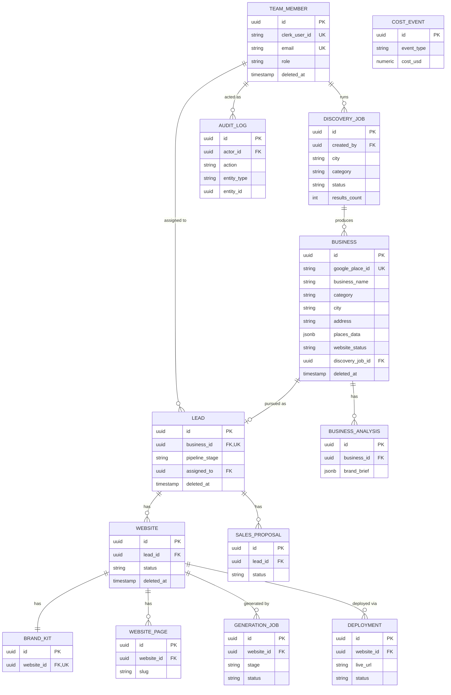

# Database Architecture — Riznexia AI Sales Platform

**Status:** Deepens Doc 06; kept in sync with the actual `packages/db/prisma/schema.prisma` as of Module M3
**Role:** Senior Database Architect pass
**Last updated:** 2026-07-29

> **Scope note:** Deepens Doc 06 (Database Design) into implementation-ready detail: full Prisma schema, explicit constraints/cascade behavior, an audit trail, and Post-MVP tables captured but inactive. PostgreSQL via Neon, per Technical Architecture §3.
>
> **Doc-sync note (2026-07-29):** This document previously described the schema as it stood before Modules M2/M3 — it's now resynced to match `packages/db/prisma/schema.prisma` exactly. Changes: `Business` split out of `Lead` (§1–§5, §8); six-role `TeamRole` enum (§5, §8); soft-delete corrected from "Prisma middleware" to a Prisma **Client Extension**, the non-deprecated mechanism, now covering four tables not three (§7); `AuditLog`'s actual (narrower than previously described) capture scope (§6); a commented-out `Organization` future table (§8, §10); migration/seed practice corrected to match what this environment actually does without a live database (§9). See DECISIONS.md D-018 through D-021, D-023–D-029.

---

## 1. ER Diagram — Active Schema



`COST_EVENT` has no FK relationships by design — it's an append-only ledger referencing entities loosely via `metadata` JSON, so it never blocks or cascades from domain-table changes (Technical Architecture §10, cost governance).

## 2. Tables

| Table               | Purpose                                                                                                              |
| ------------------- | -------------------------------------------------------------------------------------------------------------------- |
| `team_members`      | Riznexia employee identity + role (mirrors Clerk)                                                                    |
| `discovery_jobs`    | Async discovery pipeline runs                                                                                        |
| `businesses`        | The real-world business and its web-presence data (Module M2 — split out of `leads`, DECISIONS.md D-018)             |
| `leads`             | Riznexia's pursuit of a `business` — pure pipeline state (stage, assignment, notes), one row per qualifying business |
| `business_analyses` | AI-derived brand briefs per business (versioned by row)                                                              |
| `websites`          | Demo website generation projects, one-to-many per lead                                                               |
| `brand_kits`        | Generated palette/typography/logo per website                                                                        |
| `website_pages`     | Generated page content per website                                                                                   |
| `generation_jobs`   | Per-stage pipeline execution records                                                                                 |
| `deployments`       | Deploy attempts and live URLs per website                                                                            |
| `sales_proposals`   | AI-drafted outreach content per lead                                                                                 |
| `cost_events`       | Append-only internal cost ledger                                                                                     |
| `audit_logs`        | Append-only security/accountability trail                                                                            |

## 3. Relationships & Cascade Behavior

| Relationship                             | Cardinality     | On parent delete | Rationale                                                                                                                            |
| ---------------------------------------- | --------------- | ---------------- | ------------------------------------------------------------------------------------------------------------------------------------ |
| `team_member → lead.assigned_to`         | 1:N             | `SET NULL`       | Removing an employee shouldn't delete or orphan-block a lead — it just becomes unassigned                                            |
| `team_member → discovery_job.created_by` | 1:N             | `SET NULL`       | Historical job record survives employee offboarding                                                                                  |
| `discovery_job → business`               | 1:N             | `SET NULL`       | A business outlives the discovery job that found it (Module M2 — this FK moved off `lead`)                                           |
| `business → lead`                        | 1:1 (unique FK) | `CASCADE`        | A lead has no independent meaning without the business it's pursuing; deleting the business deletes the pursuit (DECISIONS.md D-018) |
| `business → business_analysis`           | 1:N             | `CASCADE`        | Analysis has no meaning without the business it analyzes (Module M2 — retargeted from `lead_id`)                                     |
| `lead → website`                         | 1:N             | `CASCADE`        | A website is generated _for_ a lead; deleting the lead deletes its demo history                                                      |
| `website → brand_kit`                    | 1:1             | `CASCADE`        | No independent lifecycle                                                                                                             |
| `website → website_page`                 | 1:N             | `CASCADE`        | No independent lifecycle                                                                                                             |
| `website → generation_job`               | 1:N             | `CASCADE`        | Job records are meaningless without the website they built                                                                           |
| `website → deployment`                   | 1:N             | `CASCADE`        | Same reasoning                                                                                                                       |
| `lead → sales_proposal`                  | 1:N             | `CASCADE`        | Proposal is meaningless without its lead                                                                                             |
| `team_member → audit_log.actor`          | 1:N             | `SET NULL`       | **Audit history must survive account deletion** — never cascade-delete an audit trail                                                |

The pattern: cascade only for records that are pure children with no independent meaning; `SET NULL` everywhere a parent's removal shouldn't destroy historically meaningful data.

## 4. Indexes

| Index                                                                            | Table               | Columns                                   | Type         | Purpose                                                                                                                                                                                                                                                                                                             |
| -------------------------------------------------------------------------------- | ------------------- | ----------------------------------------- | ------------ | ------------------------------------------------------------------------------------------------------------------------------------------------------------------------------------------------------------------------------------------------------------------------------------------------------------------- |
| `leads_pipeline_stage_idx`                                                       | `leads`             | `(pipeline_stage)`                        | btree        | Pipeline/kanban filtering                                                                                                                                                                                                                                                                                           |
| `leads_assigned_to_idx`                                                          | `leads`             | `(assigned_to)`                           | btree        | "My leads" filtering                                                                                                                                                                                                                                                                                                |
| `leads_deleted_at_idx`                                                           | `leads`             | `(deleted_at)`                            | btree        | Soft-delete scoping (now applied automatically by a Prisma Client Extension, §7 — this index just makes that scoping cheap)                                                                                                                                                                                         |
| `businesses_google_place_id_key`                                                 | `businesses`        | `(google_place_id)`                       | unique btree | Dedupe on re-discovery (moved off `leads`, Module M2)                                                                                                                                                                                                                                                               |
| `businesses_deleted_at_idx`                                                      | `businesses`        | `(deleted_at)`                            | btree        | Soft-delete scoping                                                                                                                                                                                                                                                                                                 |
| `businesses_city_idx`, `businesses_category_idx`, `businesses_business_name_idx` | `businesses`        | `(city)`, `(category)`, `(business_name)` | btree        | Pipeline/lead-list filter and search views (moved off `leads`, Module M2; the `business_name` one is plain btree, not a use a trigram/GIN index for the `contains` wildcard search `GET /leads?q=` actually runs — deliberately not added without a live database to verify the syntax against, DECISIONS.md D-015) |
| `businesses_discovery_job_id_idx`                                                | `businesses`        | `(discovery_job_id)`                      | btree        | Job-detail business lookup                                                                                                                                                                                                                                                                                          |
| `websites_lead_id_idx`                                                           | `websites`          | `(lead_id)`                               | btree        | Lead-detail website lookup                                                                                                                                                                                                                                                                                          |
| `deployments_website_deployed_idx`                                               | `deployments`       | `(website_id, deployed_at DESC)`          | btree        | Latest-deployment lookup                                                                                                                                                                                                                                                                                            |
| `generation_jobs_website_stage_idx`                                              | `generation_jobs`   | `(website_id, stage)`                     | btree        | Pipeline-stepper status query                                                                                                                                                                                                                                                                                       |
| `business_analyses_business_created_idx`                                         | `business_analyses` | `(business_id, created_at DESC)`          | btree        | Latest-analysis lookup (retargeted from `lead_id`, Module M2)                                                                                                                                                                                                                                                       |
| `cost_events_created_at_idx`                                                     | `cost_events`       | `(created_at)`                            | btree        | Cost dashboard period rollups                                                                                                                                                                                                                                                                                       |
| `cost_events_type_created_idx`                                                   | `cost_events`       | `(event_type, created_at)`                | btree        | Cost breakdown by type                                                                                                                                                                                                                                                                                              |
| `audit_logs_entity_idx`                                                          | `audit_logs`        | `(entity_type, entity_id)`                | btree        | "Show history for this record"                                                                                                                                                                                                                                                                                      |
| `audit_logs_actor_created_idx`                                                   | `audit_logs`        | `(actor_id, created_at DESC)`             | btree        | "Show this employee's activity"                                                                                                                                                                                                                                                                                     |

A `places_data` full-text/JSON GIN index (previously listed here against `leads`) was never actually added and isn't currently planned — noted as a Post-MVP possibility, not overstated as done or scheduled.

## 5. Constraints

- **Primary keys:** UUID (`gen_random_uuid()` / Prisma `uuid()`), never sequential integers — avoids record-count leakage and enumeration.
- **Uniqueness:** `team_members.clerk_user_id`, `team_members.email`, `businesses.google_place_id` (moved off `leads`, Module M2), `leads.business_id` (enforces the business↔lead 1:1), `brand_kits.website_id` (enforces the 1:1), `website_pages(website_id, slug)` composite (a website can't have two pages with the same slug).
- **Enums enforced at the database level** (Postgres native enum types, generated by Prisma from schema enums) — not just validated in application code: `team_role` (six values as of Module M3: `SUPER_ADMIN`, `ADMIN`, `SALES_MANAGER`, `DEVELOPER`, `SALES_EXECUTIVE`, `VIEWER` — DECISIONS.md D-024), `pipeline_stage`, `website_status_type`, `website_gen_status`, `generation_stage`, `job_status`, `proposal_status`, `discovery_job_status`. An invalid status value is rejected by Postgres itself, not just by a zod schema upstream.
- **NOT NULL by default** — every column is required unless explicitly modeled as optional (Prisma `?`); optionality is a deliberate modeling decision (e.g., `assigned_to`, `logo_asset_url`, `error_message`), not a default.
- **Decimal precision for money:** `cost_events.cost_usd` is `DECIMAL(10,4)`, never `FLOAT` — cost figures must not accumulate floating-point drift given they're summed for quota enforcement.

## 6. Audit Tables

`audit_logs` is an **append-only** table (no update/delete path in application code — enforced by convention and reviewed in PRs, not a DB-level trigger at MVP scale) for security- and accountability-relevant events.

**Actually built (Module M3, DECISIONS.md D-028):** the write path — `AuditLogService.record()` — plus `@Audited()`/`AuditLogInterceptor`, a global, opt-in mechanism that writes one row after a decorated route's handler succeeds. **No route in the app carries `@Audited()` yet** — none of the currently-built endpoints (`GET /leads`, `GET/POST /discovery-jobs`) are privileged actions in the RBAC sense, and adding a role-change or team-management endpoint just to have something to audit would have pulled a different module's scope into M3 (DECISIONS.md D-028). The mechanism is proven end-to-end via a dedicated test-only controller (`apps/api/test/rbac.e2e-spec.ts`), not a real route.

**Not yet built** — described here as intended future behavior, not current state:

- Role changes (`team.role_changed`), team member invites/removals (`team.invited`, `team.removed`) — land with the Team & Settings backlog item or Module M4.
- Pipeline-stage changes on high-value transitions (`lead.stage_changed` to `won`/`lost`) — lands with Module M4 (Lead Management APIs).
- **Failed authorization attempts are not audit-logged.** A role/permission-check denial today is a standard `403 FORBIDDEN` HTTP response; it is not written to `audit_log`. Security Strategy §8 previously claimed this was "logged distinctly" — corrected there too (2026-07-29 doc-sync pass) rather than left overstated.

Each row: `actor_id` (nullable — see §3), `action` (a fixed vocabulary string, e.g. `lead.stage_changed`), `entity_type` + `entity_id` (what was acted on), `metadata` (before/after values where relevant), `ip_address`, `created_at`. This is deliberately generic/polymorphic (one table, not one per entity type) — the volume at this system's scale doesn't justify per-entity audit tables, and a single table makes "show me everything this employee did" a single indexed query (§4).

## 7. Soft Delete

Applied to `team_members`, `businesses`, `leads`, and `websites` — the records where accidental loss is costly and recovery matters (Doc 06 §1 principle carried forward; `businesses` added in Module M2 when it split out of `leads`, DECISIONS.md D-018). **Not** applied to child records (`business_analyses`, `website_pages`, `generation_jobs`, `deployments`, `sales_proposals`) — those cascade-hard-delete with their parent (§3), since they have no independent meaning to recover.

- **Pattern:** nullable `deleted_at` timestamp. A "delete" action is an `UPDATE ... SET deleted_at = now()`, never a `DELETE` statement, on these four tables.
- **Default-scope enforcement:** a Prisma **Client Extension** (`packages/db/src/soft-delete.extension.ts`, Module M2, DECISIONS.md D-019) — not Prisma middleware, the now-deprecated mechanism this section originally described — automatically scopes `findFirst`/`findMany`/`findUnique`/`count` to `deletedAt: null` and reroutes `delete`/`deleteMany` into an update on these four models, so application code cannot forget the filter. Mirrors the tenant-scoping-by-construction pattern from Doc 12 §2, applied here to soft-delete instead. **Known limitation:** the extension only scopes the top-level model a query is issued against, not rows reached through a nested Prisma `include`/relation filter — call sites that join across these models (e.g. `LeadsService` including `Business`) add the `deletedAt: null` filter explicitly for the nested relation (DECISIONS.md D-019).
- **Hard-delete purge:** described here as intended future behavior, **not yet built.** No scheduled job currently removes rows past the retention window; this remains a design intent for the Observability & Hardening backlog item (docs/21-implementation-roadmap.md §5), not a claim that it runs today.
- **Restore:** since nothing is hard-deleted yet (the purge job doesn't exist), every soft-deleted row today is recoverable by clearing `deleted_at` directly — there's no 90-day expiry currently enforced in practice, even though that's the intended eventual behavior.

## 8. Prisma Schema

```prisma
// Prisma schema — see docs/18-database-architecture.md for full original
// design rationale (relationships, cascade behavior, indexes, soft-delete
// pattern, audit log), and Module M2 (docs/21-implementation-roadmap.md,
// DECISIONS.md D-017+) for the Business/Lead split introduced here.
// Future/Post-MVP models are intentionally commented out at the bottom (§10).

datasource db {
  provider = "postgresql"
  url      = env("DATABASE_URL")
}

generator client {
  provider = "prisma-client-js"
}

// ---------- Enums ----------

// Module M3 (DECISIONS.md D-023+) — six-role taxonomy, replacing the
// original three (ADMIN/MANAGER/SALES_REP). SUPER_ADMIN/ADMIN/SALES_MANAGER
// are seniority-ordered within the sales chain of command; DEVELOPER is a
// lateral technical-access role, not a rung on that same ladder; VIEWER is
// strictly read-only. The numeric hierarchy used for "at least this
// seniority" checks lives in code (apps/api/src/common/rbac/role-hierarchy.constants.ts),
// not here — Postgres enum ordinals are not relied on for authorization logic.
enum TeamRole {
  SUPER_ADMIN
  ADMIN
  SALES_MANAGER
  DEVELOPER
  SALES_EXECUTIVE
  VIEWER
}

enum WebsiteStatusType {
  NONE
  OUTDATED
  PRESENT
}

enum PipelineStage {
  NEW
  QUALIFIED
  CONTACTED
  IN_DISCUSSION
  WON
  LOST
}

enum WebsiteGenStatus {
  DRAFT
  GENERATING
  READY_FOR_REVIEW
  DEPLOYED
  FAILED
}

enum GenerationStage {
  ANALYSIS
  BRAND
  CONTENT
  IMAGE
  SEO
  BUILD
}

enum JobStatus {
  QUEUED
  RUNNING
  COMPLETED
  FAILED
}

enum ProposalStatus {
  DRAFT
  EDITED
  SENT_MANUALLY
}

enum DiscoveryJobStatus {
  QUEUED
  RUNNING
  COMPLETED
  FAILED
}

// ---------- Active Models ----------

// Module M3: this is a single-organization employee directory today — every
// row implicitly belongs to Riznexia's one internal workspace. An
// `organizationId` FK would attach here if/when multi-org support is ever
// built; see the commented-out `Organization` model in the FUTURE section
// below. Not added as a real column now (nothing consumes it) — kept as a
// documented attachment point, not spec'd-ahead-of-need schema.
model TeamMember {
  id          String    @id @default(uuid())
  clerkUserId String    @unique @map("clerk_user_id")
  name        String
  email       String    @unique
  role        TeamRole  @default(SALES_EXECUTIVE)
  createdAt   DateTime  @default(now()) @map("created_at")
  updatedAt   DateTime  @updatedAt @map("updated_at")
  deletedAt   DateTime? @map("deleted_at")

  discoveryJobs DiscoveryJob[]
  assignedLeads Lead[]         @relation("AssignedLeads")
  auditLogs     AuditLog[]

  @@index([deletedAt])
  @@map("team_members")
}

model DiscoveryJob {
  id           String             @id @default(uuid())
  createdById  String?            @map("created_by")
  createdBy    TeamMember?        @relation(fields: [createdById], references: [id], onDelete: SetNull)
  city         String
  category     String
  status       DiscoveryJobStatus @default(QUEUED)
  resultsCount Int                @default(0) @map("results_count")
  createdAt    DateTime           @default(now()) @map("created_at")

  // Doc 22 §5/§6 (M1) — a discovery run finds Businesses; only a subset of
  // those (none/outdated) go on to get a Lead (M2 §Business split below).
  businesses Business[]

  @@index([createdById])
  @@map("discovery_jobs")
}

// Module M2 addition: the "what" — a real-world business and everything we
// know about its web presence, independent of whether Riznexia is actively
// pursuing it. Previously these fields lived directly on Lead; splitting
// them out means a discovered business that turns out to already have a
// good website (`PRESENT`) is still recorded (for FR-1.7 refresh semantics
// and future dedupe) without implying a sales pursuit exists for it.
model Business {
  id             String            @id @default(uuid())
  googlePlaceId  String            @unique @map("google_place_id")
  businessName   String            @map("business_name")
  category       String
  city           String
  address        String
  placesData     Json              @map("places_data")
  websiteStatus  WebsiteStatusType @default(NONE) @map("website_status")
  discoveryJobId String?           @map("discovery_job_id")
  discoveryJob   DiscoveryJob?     @relation(fields: [discoveryJobId], references: [id], onDelete: SetNull)
  createdAt      DateTime          @default(now()) @map("created_at")
  updatedAt      DateTime          @updatedAt @map("updated_at")
  deletedAt      DateTime?         @map("deleted_at")

  // A Business has at most one Lead — created once, the first time it
  // qualifies (none/outdated); see BusinessService/LeadsService for the
  // exact upsert-then-conditionally-create flow this enforces.
  lead             Lead?
  businessAnalyses BusinessAnalysis[]

  @@index([deletedAt])
  @@index([city])
  @@index([category])
  @@index([discoveryJobId])
  // Plain btree — helps exact-match/prefix lookups and sorting, not the
  // `contains`/ILIKE wildcard search GET /leads?q= actually runs (Doc 19
  // §5). A trigram GIN index would serve that better; deliberately not
  // added without a live database to verify the syntax against (Doc 22
  // audit finding #7, DECISIONS.md D-015).
  @@index([businessName])
  @@map("businesses")
}

// The "so what" — Riznexia's own pursuit of a Business. Pure pipeline
// state: no business-data fields live here anymore (Module M2). Doc 19's
// public `GET /leads` response shape is unchanged — it's now assembled by
// joining Business, not read directly off this table.
model Lead {
  id            String        @id @default(uuid())
  businessId    String        @unique @map("business_id")
  business      Business      @relation(fields: [businessId], references: [id], onDelete: Cascade)
  pipelineStage PipelineStage @default(NEW) @map("pipeline_stage")
  assignedToId  String?       @map("assigned_to")
  assignedTo    TeamMember?   @relation("AssignedLeads", fields: [assignedToId], references: [id], onDelete: SetNull)
  notes         String?
  createdAt     DateTime      @default(now()) @map("created_at")
  updatedAt     DateTime      @updatedAt @map("updated_at")
  deletedAt     DateTime?     @map("deleted_at")

  websites  Website[]
  proposals SalesProposal[]

  @@index([pipelineStage])
  @@index([assignedToId])
  @@index([deletedAt])
  @@map("leads")
}

model BusinessAnalysis {
  id               String   @id @default(uuid())
  businessId       String   @map("business_id")
  business         Business @relation(fields: [businessId], references: [id], onDelete: Cascade)
  brandBrief       Json     @map("brand_brief")
  sentimentSummary Json?    @map("sentiment_summary")
  aiModelUsed      String   @map("ai_model_used")
  createdAt        DateTime @default(now()) @map("created_at")

  @@index([businessId, createdAt])
  @@map("business_analyses")
}

model Website {
  id          String           @id @default(uuid())
  leadId      String           @map("lead_id")
  lead        Lead             @relation(fields: [leadId], references: [id], onDelete: Cascade)
  status      WebsiteGenStatus @default(DRAFT)
  templateKey String           @map("template_key")
  createdAt   DateTime         @default(now()) @map("created_at")
  updatedAt   DateTime         @updatedAt @map("updated_at")
  deletedAt   DateTime?        @map("deleted_at")

  brandKit       BrandKit?
  pages          WebsitePage[]
  generationJobs GenerationJob[]
  deployments    Deployment[]

  @@index([leadId])
  @@index([deletedAt])
  @@map("websites")
}

model BrandKit {
  id           String   @id @default(uuid())
  websiteId    String   @unique @map("website_id")
  website      Website  @relation(fields: [websiteId], references: [id], onDelete: Cascade)
  palette      Json
  typography   Json
  logoAssetUrl String?  @map("logo_asset_url")
  createdAt    DateTime @default(now()) @map("created_at")

  @@map("brand_kits")
}

model WebsitePage {
  id                 String   @id @default(uuid())
  websiteId          String   @map("website_id")
  website            Website  @relation(fields: [websiteId], references: [id], onDelete: Cascade)
  slug               String
  title              String
  contentBlocks      Json     @map("content_blocks")
  seoMetaTitle       String?  @map("seo_meta_title")
  seoMetaDescription String?  @map("seo_meta_description")
  updatedAt          DateTime @updatedAt @map("updated_at")

  @@unique([websiteId, slug])
  @@map("website_pages")
}

model GenerationJob {
  id              String          @id @default(uuid())
  websiteId       String          @map("website_id")
  website         Website         @relation(fields: [websiteId], references: [id], onDelete: Cascade)
  stage           GenerationStage
  status          JobStatus       @default(QUEUED)
  aiUsageMetadata Json?           @map("ai_usage_metadata")
  errorMessage    String?         @map("error_message")
  createdAt       DateTime        @default(now()) @map("created_at")

  @@index([websiteId, stage])
  @@map("generation_jobs")
}

model Deployment {
  id              String    @id @default(uuid())
  websiteId       String    @map("website_id")
  website         Website   @relation(fields: [websiteId], references: [id], onDelete: Cascade)
  githubRepoUrl   String?   @map("github_repo_url")
  vercelProjectId String?   @map("vercel_project_id")
  liveUrl         String?   @map("live_url")
  status          JobStatus @default(QUEUED)
  deployedAt      DateTime? @map("deployed_at")
  createdAt       DateTime  @default(now()) @map("created_at")

  @@index([websiteId, deployedAt])
  @@map("deployments")
}

model SalesProposal {
  id           String         @id @default(uuid())
  leadId       String         @map("lead_id")
  lead         Lead           @relation(fields: [leadId], references: [id], onDelete: Cascade)
  draftContent String         @map("draft_content")
  status       ProposalStatus @default(DRAFT)
  createdAt    DateTime       @default(now()) @map("created_at")
  updatedAt    DateTime       @updatedAt @map("updated_at")

  @@index([leadId])
  @@map("sales_proposals")
}

model CostEvent {
  id        String   @id @default(uuid())
  eventType String   @map("event_type")
  metadata  Json?
  costUsd   Decimal  @map("cost_usd") @db.Decimal(10, 4)
  createdAt DateTime @default(now()) @map("created_at")

  @@index([createdAt])
  @@index([eventType, createdAt])
  @@map("cost_events")
}

model AuditLog {
  id         String      @id @default(uuid())
  actorId    String?     @map("actor_id")
  actor      TeamMember? @relation(fields: [actorId], references: [id], onDelete: SetNull)
  action     String
  entityType String      @map("entity_type")
  entityId   String      @map("entity_id")
  metadata   Json?
  ipAddress  String?     @map("ip_address")
  createdAt  DateTime    @default(now()) @map("created_at")

  @@index([entityType, entityId])
  @@index([actorId, createdAt])
  @@map("audit_logs")
}

// ============================================================
// FUTURE (INACTIVE) — Post-MVP models. Intentionally commented
// out: captured in version control as approved design intent,
// but NOT part of the active migration set. Uncomment + run a
// migration only when the corresponding feature is greenlit.
// See docs/16-system-architecture.md §20 (Future Expansion Plan)
// and docs/18-database-architecture.md §10 for rationale per table.
// ============================================================

// Module M3 future-readiness note: if multi-org support is ever built,
// TeamMember gains a required `organizationId` FK to this table and every
// RBAC/permission check (apps/api/src/common/rbac/) scopes to it. Today
// there is exactly one implicit organization (Riznexia itself), so this
// stays commented out rather than adding a column nothing reads yet.
// model Organization {
//   id        String   @id @default(uuid())
//   name      String
//   slug      String   @unique
//   createdAt DateTime @default(now()) @map("created_at")
//
//   @@map("organizations")
// }

// model Agency {
//   id        String   @id @default(uuid())
//   name      String
//   slug      String   @unique
//   createdAt DateTime @default(now()) @map("created_at")
//
//   @@map("agencies")
// }

// model Subscription {
//   id                    String   @id @default(uuid())
//   agencyId              String   @map("agency_id")
//   stripeSubscriptionId  String   @unique @map("stripe_subscription_id")
//   planKey               String   @map("plan_key")
//   status                String
//   currentPeriodEnd      DateTime @map("current_period_end")
//
//   @@map("subscriptions")
// }

// model ClientPortalUser {
//   id           String   @id @default(uuid())
//   leadId       String   @map("lead_id")
//   email        String   @unique
//   clerkUserId  String?  @unique @map("clerk_user_id")
//   createdAt    DateTime @default(now()) @map("created_at")
//
//   @@map("client_portal_users")
// }

// model LeadScore {
//   id           String   @id @default(uuid())
//   leadId       String   @map("lead_id")
//   score        Float
//   modelVersion String   @map("model_version")
//   computedAt   DateTime @default(now()) @map("computed_at")
//
//   @@index([leadId, computedAt])
//   @@map("lead_scores")
// }

// model WebhookSubscription {
//   id         String   @id @default(uuid())
//   url        String
//   eventTypes String[] @map("event_types")
//   secret     String
//   active     Boolean  @default(false)
//   createdAt  DateTime @default(now()) @map("created_at")
//
//   @@map("webhook_subscriptions")
// }

// model DemoFeedback {
//   id         String   @id @default(uuid())
//   websiteId  String   @map("website_id")
//   rating     Int
//   comment    String?
//   createdAt  DateTime @default(now()) @map("created_at")
//
//   @@map("demo_feedback")
// }
```

## 9. Migration Strategy

- **Tooling:** Prisma Migrate. `prisma migrate dev` locally generates timestamped migration files (`{timestamp}_{description}/migration.sql`); `prisma migrate deploy` runs them in CI/CD — never `db push` outside local prototyping (Doc 14 §4 already establishes this; repeated here as the DB-specific detail).
- **Actual practice in this environment (no live/shadow database available):** every migration to date (`20260728000000_init`, `20260729000000_m3_rbac_role_taxonomy`) was hand-authored using `prisma migrate diff --from-empty --to-schema-datamodel` — which needs no database connection — and cross-checked against the final schema state rather than generated interactively via `prisma migrate dev`. Each is still committed, reviewed, and applied via `prisma migrate deploy` in CI/CD once a real database exists; only the _authoring_ step deviates from the ideal workflow above (DECISIONS.md D-020, D-024).
- **Review:** every migration file is committed and reviewed in the same PR as the corresponding `schema.prisma` change — a schema change without a migration file (or vice versa) fails CI.
- **Zero-downtime, expand/contract:**
  1. _Expand:_ add new column as nullable (or with a default), deploy.
  2. _Backfill:_ a one-off script/job populates the new column for existing rows.
  3. _Contract:_ a follow-up migration adds `NOT NULL` (if required) or drops the old column.
     This means a rolling deploy never has old code hitting a schema it doesn't understand or new code hitting a schema that isn't ready yet.
- **Destructive migrations** (drop column/table, non-nullable additions without a default) require the manual approval gate on production promotion (Deployment Strategy §3) — never auto-applied.
- **Enum changes:** Postgres enum alteration (`ADD VALUE`) is additive-safe; removing/renaming an enum value requires a migration that first moves affected rows to a new/valid value — planned explicitly, never done blind. The Module M3 role-taxonomy migration is a worked example: `ADD VALUE` for the three net-new roles, `RENAME VALUE` for the two renamed ones, verified to produce the same end state as a from-empty diff before being committed (DECISIONS.md D-024).
- **Seed data:** `packages/db/prisma/seed.ts` is built (Module M1/M2/M3, not a future deliverable) — seeds local/staging with one fixture `team_member` per role, sample `business`/`lead` fixtures spanning every `website_status`, never runs against production.

## 10. Future Expansion (Inactive Tables)

| Table                   | Trigger to activate                                                                                      | Why it's designed now, not built now                                                                                                                                     |
| ----------------------- | -------------------------------------------------------------------------------------------------------- | ------------------------------------------------------------------------------------------------------------------------------------------------------------------------ |
| `organizations`         | Riznexia decides to support more than one internal workspace/tenant                                      | Module M3 (DECISIONS.md D-027) — a concrete attachment point (`TeamMember.organizationId` would FK here) already designed, no column added since nothing consumes it yet |
| `agencies`              | Riznexia decides to externalize this as a multi-tenant product                                           | Every active table would need an `agency_id` column added in the same wave — having the shape agreed now means that future migration is mechanical, not a redesign       |
| `subscriptions`         | Same as above, plus a billing decision                                                                   | No customer to bill today (BRD, explicit non-goal)                                                                                                                       |
| `client_portal_users`   | Riznexia decides prospects need self-serve access to their demo                                          | Explicit non-goal today (PRD); kept ready since the schema shape (email + optional Clerk link) is the obvious one regardless of when it happens                          |
| `lead_scores`           | Enough `business_analysis`/`cost_event` history exists to train/justify a scoring model                  | Doc 16 §20 — needs real usage data first                                                                                                                                 |
| `webhook_subscriptions` | Riznexia wants to push events (e.g., `lead.won`) into an external CRM/Slack                              | Not a current requirement, but a common next-integration ask worth having the shape for                                                                                  |
| `demo_feedback`         | Riznexia wants prospects to be able to react to a demo (e.g., a lightweight widget on the deployed site) | Would be the first table ever written to by a non-employee — deliberately deferred until that trust boundary is a real decision, not an accidental side door             |

None of these are created by an active migration. They exist in `schema.prisma` as commented-out models specifically so the design is reviewed and versioned now, while the schema.prisma actually applied to the database contains only the 13 active models in §2 (12 at Module M2's close, plus `organizations` added to this inactive list in Module M3 — not an active model, just a seventh commented-out one).

---

**Database architecture complete as originally delivered; kept in sync with the implemented schema through Module M3 (2026-07-29 doc-sync pass, DECISIONS.md D-029). Modules M1–M3 (Project Setup, Lead Discovery, Database & Core Domain Models, Authentication & RBAC) are built against this schema — see TASKS.md and docs/21-implementation-roadmap.md for current status.**
