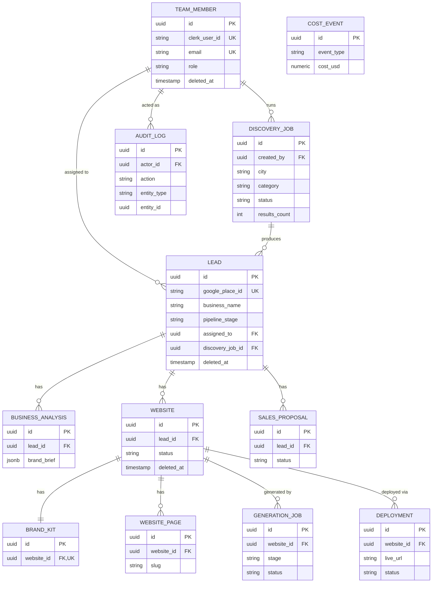

# Database Architecture — Riznexia AI Sales Platform

**Status:** Draft — deep database design deliverable
**Role:** Senior Database Architect pass
**Last updated:** 2026-07-27

> **Scope note:** Deepens Doc 06 (Database Design) into implementation-ready detail: full Prisma schema, explicit constraints/cascade behavior, an audit trail, and Post-MVP tables captured but inactive. PostgreSQL via Neon, per Technical Architecture §3.

---

## 1. ER Diagram — Active Schema



`COST_EVENT` has no FK relationships by design — it's an append-only ledger referencing entities loosely via `metadata` JSON, so it never blocks or cascades from domain-table changes (Technical Architecture §10, cost governance).

## 2. Tables

| Table | Purpose |
|---|---|
| `team_members` | Riznexia employee identity + role (mirrors Clerk) |
| `discovery_jobs` | Async discovery pipeline runs |
| `leads` | Core discovered businesses, pipeline state |
| `business_analyses` | AI-derived brand briefs per lead (versioned by row) |
| `websites` | Demo website generation projects, one-to-many per lead |
| `brand_kits` | Generated palette/typography/logo per website |
| `website_pages` | Generated page content per website |
| `generation_jobs` | Per-stage pipeline execution records |
| `deployments` | Deploy attempts and live URLs per website |
| `sales_proposals` | AI-drafted outreach content per lead |
| `cost_events` | Append-only internal cost ledger |
| `audit_logs` | Append-only security/accountability trail |

## 3. Relationships & Cascade Behavior

| Relationship | Cardinality | On parent delete | Rationale |
|---|---|---|---|
| `team_member → lead.assigned_to` | 1:N | `SET NULL` | Removing an employee shouldn't delete or orphan-block a lead — it just becomes unassigned |
| `team_member → discovery_job.created_by` | 1:N | `SET NULL` | Historical job record survives employee offboarding |
| `discovery_job → lead` | 1:N | `SET NULL` | A lead outlives the discovery job that found it |
| `lead → business_analysis` | 1:N | `CASCADE` | Analysis has no meaning without its lead |
| `lead → website` | 1:N | `CASCADE` | A website is generated *for* a lead; deleting the lead deletes its demo history |
| `website → brand_kit` | 1:1 | `CASCADE` | No independent lifecycle |
| `website → website_page` | 1:N | `CASCADE` | No independent lifecycle |
| `website → generation_job` | 1:N | `CASCADE` | Job records are meaningless without the website they built |
| `website → deployment` | 1:N | `CASCADE` | Same reasoning |
| `lead → sales_proposal` | 1:N | `CASCADE` | Proposal is meaningless without its lead |
| `team_member → audit_log.actor` | 1:N | `SET NULL` | **Audit history must survive account deletion** — never cascade-delete an audit trail |

The pattern: cascade only for records that are pure children with no independent meaning; `SET NULL` everywhere a parent's removal shouldn't destroy historically meaningful data.

## 4. Indexes

| Index | Table | Columns | Type | Purpose |
|---|---|---|---|---|
| `leads_pipeline_stage_idx` | `leads` | `(pipeline_stage)` | btree | Pipeline/kanban filtering |
| `leads_assigned_to_idx` | `leads` | `(assigned_to)` | btree | "My leads" filtering |
| `leads_google_place_id_key` | `leads` | `(google_place_id)` | unique btree | Dedupe on re-discovery |
| `leads_deleted_at_idx` | `leads` | `(deleted_at)` | partial btree, `WHERE deleted_at IS NULL` | Fast default-scope queries excluding soft-deleted rows |
| `websites_lead_id_idx` | `websites` | `(lead_id)` | btree | Lead-detail website lookup |
| `deployments_website_deployed_idx` | `deployments` | `(website_id, deployed_at DESC)` | btree | Latest-deployment lookup |
| `generation_jobs_website_stage_idx` | `generation_jobs` | `(website_id, stage)` | btree | Pipeline-stepper status query |
| `business_analyses_lead_created_idx` | `business_analyses` | `(lead_id, created_at DESC)` | btree | Latest-analysis lookup |
| `cost_events_created_at_idx` | `cost_events` | `(created_at)` | btree | Cost dashboard period rollups |
| `cost_events_type_created_idx` | `cost_events` | `(event_type, created_at)` | btree | Cost breakdown by type |
| `audit_logs_entity_idx` | `audit_logs` | `(entity_type, entity_id)` | btree | "Show history for this record" |
| `audit_logs_actor_created_idx` | `audit_logs` | `(actor_id, created_at DESC)` | btree | "Show this employee's activity" |
| `leads_places_data_gin` | `leads` | `(places_data)` | GIN | Future full-text/JSON search over raw Places payload (Post-MVP, not required for MVP query patterns but cheap to add now) |

## 5. Constraints

- **Primary keys:** UUID (`gen_random_uuid()` / Prisma `uuid()`), never sequential integers — avoids record-count leakage and enumeration.
- **Uniqueness:** `team_members.clerk_user_id`, `team_members.email`, `leads.google_place_id`, `brand_kits.website_id` (enforces the 1:1), `website_pages(website_id, slug)` composite (a website can't have two pages with the same slug).
- **Enums enforced at the database level** (Postgres native enum types, generated by Prisma from schema enums) — not just validated in application code: `team_role`, `pipeline_stage`, `website_status_type`, `website_gen_status`, `generation_stage`, `job_status`, `proposal_status`, `discovery_job_status`. An invalid status value is rejected by Postgres itself, not just by a zod schema upstream.
- **NOT NULL by default** — every column is required unless explicitly modeled as optional (Prisma `?`); optionality is a deliberate modeling decision (e.g., `assigned_to`, `logo_asset_url`, `error_message`), not a default.
- **Decimal precision for money:** `cost_events.cost_usd` is `DECIMAL(10,4)`, never `FLOAT` — cost figures must not accumulate floating-point drift given they're summed for quota enforcement.

## 6. Audit Tables

`audit_logs` is an **append-only** table (no update/delete path in application code — enforced by convention and reviewed in PRs, not a DB-level trigger at MVP scale) capturing security- and accountability-relevant events:

- Role changes (`team.role_changed`)
- Team member invites/removals (`team.invited`, `team.removed`)
- Pipeline-stage changes on high-value transitions (`lead.stage_changed` to `won`/`lost`)
- Any Admin/Manager-only action (cost dashboard access, team management)
- Failed authorization attempts (a Sales Rep hitting a role-gated endpoint) — logged distinctly per Security Strategy §8

Each row: `actor_id` (nullable — see §3), `action` (a fixed vocabulary string, e.g. `lead.stage_changed`), `entity_type` + `entity_id` (what was acted on), `metadata` (before/after values where relevant), `ip_address`, `created_at`. This is deliberately generic/polymorphic (one table, not one per entity type) — the volume at this system's scale doesn't justify per-entity audit tables, and a single table makes "show me everything this employee did" a single indexed query (§4).

## 7. Soft Delete

Applied to `team_members`, `leads`, and `websites` — the records where accidental loss is costly and recovery matters (Doc 06 §1 principle carried forward). **Not** applied to child records (`business_analyses`, `website_pages`, `generation_jobs`, `deployments`, `sales_proposals`) — those cascade-hard-delete with their parent (§3), since they have no independent meaning to recover.

- **Pattern:** nullable `deleted_at` timestamp. A "delete" action is an `UPDATE ... SET deleted_at = now()`, never a `DELETE` statement, on these three tables.
- **Default-scope enforcement:** a Prisma middleware (`packages/db`) automatically appends `WHERE deleted_at IS NULL` to every query against these three models, so application code cannot forget the filter — mirrors the tenant-scoping-by-construction pattern from Doc 12 §2, applied here to soft-delete instead.
- **Hard-delete purge:** a scheduled job (Trigger.dev, weekly) permanently removes rows where `deleted_at < now() - interval '90 days'`, per Security Strategy §7's retention window. This is the only path that issues a real `DELETE`.
- **Restore:** since data is never actually gone until the 90-day purge, an accidental delete is recoverable by an Admin clearing `deleted_at` — no restore-from-backup needed for the common case.

## 8. Prisma Schema

```prisma
datasource db {
  provider = "postgresql"
  url      = env("DATABASE_URL")
}

generator client {
  provider = "prisma-client-js"
}

// ---------- Enums ----------

enum TeamRole {
  ADMIN
  MANAGER
  SALES_REP
}

enum WebsiteStatusType {
  NONE
  OUTDATED
  PRESENT
}

enum PipelineStage {
  NEW
  QUALIFIED
  CONTACTED
  IN_DISCUSSION
  WON
  LOST
}

enum WebsiteGenStatus {
  DRAFT
  GENERATING
  READY_FOR_REVIEW
  DEPLOYED
  FAILED
}

enum GenerationStage {
  ANALYSIS
  BRAND
  CONTENT
  IMAGE
  SEO
  BUILD
}

enum JobStatus {
  QUEUED
  RUNNING
  COMPLETED
  FAILED
}

enum ProposalStatus {
  DRAFT
  EDITED
  SENT_MANUALLY
}

enum DiscoveryJobStatus {
  QUEUED
  RUNNING
  COMPLETED
  FAILED
}

// ---------- Active Models ----------

model TeamMember {
  id          String    @id @default(uuid())
  clerkUserId String    @unique @map("clerk_user_id")
  name        String
  email       String    @unique
  role        TeamRole  @default(SALES_REP)
  createdAt   DateTime  @default(now()) @map("created_at")
  updatedAt   DateTime  @updatedAt @map("updated_at")
  deletedAt   DateTime? @map("deleted_at")

  discoveryJobs DiscoveryJob[]
  assignedLeads Lead[]         @relation("AssignedLeads")
  auditLogs     AuditLog[]

  @@index([deletedAt])
  @@map("team_members")
}

model DiscoveryJob {
  id           String              @id @default(uuid())
  createdById  String?             @map("created_by")
  createdBy    TeamMember?         @relation(fields: [createdById], references: [id], onDelete: SetNull)
  city         String
  category     String
  status       DiscoveryJobStatus  @default(QUEUED)
  resultsCount Int                 @default(0) @map("results_count")
  createdAt    DateTime            @default(now()) @map("created_at")

  leads Lead[]

  @@index([createdById])
  @@map("discovery_jobs")
}

model Lead {
  id             String            @id @default(uuid())
  googlePlaceId  String            @unique @map("google_place_id")
  businessName   String            @map("business_name")
  category       String
  city           String
  address        String
  placesData     Json              @map("places_data")
  websiteStatus  WebsiteStatusType @default(NONE) @map("website_status")
  pipelineStage  PipelineStage     @default(NEW) @map("pipeline_stage")
  assignedToId   String?           @map("assigned_to")
  assignedTo     TeamMember?       @relation("AssignedLeads", fields: [assignedToId], references: [id], onDelete: SetNull)
  discoveryJobId String?           @map("discovery_job_id")
  discoveryJob   DiscoveryJob?     @relation(fields: [discoveryJobId], references: [id], onDelete: SetNull)
  notes          String?
  createdAt      DateTime          @default(now()) @map("created_at")
  updatedAt      DateTime          @updatedAt @map("updated_at")
  deletedAt      DateTime?         @map("deleted_at")

  businessAnalyses BusinessAnalysis[]
  websites         Website[]
  proposals        SalesProposal[]

  @@index([pipelineStage])
  @@index([assignedToId])
  @@index([deletedAt])
  @@map("leads")
}

model BusinessAnalysis {
  id               String   @id @default(uuid())
  leadId           String   @map("lead_id")
  lead             Lead     @relation(fields: [leadId], references: [id], onDelete: Cascade)
  brandBrief       Json     @map("brand_brief")
  sentimentSummary Json?    @map("sentiment_summary")
  aiModelUsed      String   @map("ai_model_used")
  createdAt        DateTime @default(now()) @map("created_at")

  @@index([leadId, createdAt])
  @@map("business_analyses")
}

model Website {
  id          String           @id @default(uuid())
  leadId      String           @map("lead_id")
  lead        Lead             @relation(fields: [leadId], references: [id], onDelete: Cascade)
  status      WebsiteGenStatus @default(DRAFT)
  templateKey String           @map("template_key")
  createdAt   DateTime         @default(now()) @map("created_at")
  updatedAt   DateTime         @updatedAt @map("updated_at")
  deletedAt   DateTime?        @map("deleted_at")

  brandKit       BrandKit?
  pages          WebsitePage[]
  generationJobs GenerationJob[]
  deployments    Deployment[]

  @@index([leadId])
  @@index([deletedAt])
  @@map("websites")
}

model BrandKit {
  id           String   @id @default(uuid())
  websiteId    String   @unique @map("website_id")
  website      Website  @relation(fields: [websiteId], references: [id], onDelete: Cascade)
  palette      Json
  typography   Json
  logoAssetUrl String?  @map("logo_asset_url")
  createdAt    DateTime @default(now()) @map("created_at")

  @@map("brand_kits")
}

model WebsitePage {
  id                 String   @id @default(uuid())
  websiteId          String   @map("website_id")
  website            Website  @relation(fields: [websiteId], references: [id], onDelete: Cascade)
  slug               String
  title              String
  contentBlocks      Json     @map("content_blocks")
  seoMetaTitle       String?  @map("seo_meta_title")
  seoMetaDescription String?  @map("seo_meta_description")
  updatedAt          DateTime @updatedAt @map("updated_at")

  @@unique([websiteId, slug])
  @@map("website_pages")
}

model GenerationJob {
  id              String          @id @default(uuid())
  websiteId       String          @map("website_id")
  website         Website         @relation(fields: [websiteId], references: [id], onDelete: Cascade)
  stage           GenerationStage
  status          JobStatus       @default(QUEUED)
  aiUsageMetadata Json?           @map("ai_usage_metadata")
  errorMessage    String?         @map("error_message")
  createdAt       DateTime        @default(now()) @map("created_at")

  @@index([websiteId, stage])
  @@map("generation_jobs")
}

model Deployment {
  id              String    @id @default(uuid())
  websiteId       String    @map("website_id")
  website         Website   @relation(fields: [websiteId], references: [id], onDelete: Cascade)
  githubRepoUrl   String?   @map("github_repo_url")
  vercelProjectId String?   @map("vercel_project_id")
  liveUrl         String?   @map("live_url")
  status          JobStatus @default(QUEUED)
  deployedAt      DateTime? @map("deployed_at")
  createdAt       DateTime  @default(now()) @map("created_at")

  @@index([websiteId, deployedAt])
  @@map("deployments")
}

model SalesProposal {
  id           String         @id @default(uuid())
  leadId       String         @map("lead_id")
  lead         Lead           @relation(fields: [leadId], references: [id], onDelete: Cascade)
  draftContent String         @map("draft_content")
  status       ProposalStatus @default(DRAFT)
  createdAt    DateTime       @default(now()) @map("created_at")
  updatedAt    DateTime       @updatedAt @map("updated_at")

  @@index([leadId])
  @@map("sales_proposals")
}

model CostEvent {
  id        String   @id @default(uuid())
  eventType String   @map("event_type")
  metadata  Json?
  costUsd   Decimal  @map("cost_usd") @db.Decimal(10, 4)
  createdAt DateTime @default(now()) @map("created_at")

  @@index([createdAt])
  @@index([eventType, createdAt])
  @@map("cost_events")
}

model AuditLog {
  id         String      @id @default(uuid())
  actorId    String?     @map("actor_id")
  actor      TeamMember? @relation(fields: [actorId], references: [id], onDelete: SetNull)
  action     String
  entityType String      @map("entity_type")
  entityId   String      @map("entity_id")
  metadata   Json?
  ipAddress  String?     @map("ip_address")
  createdAt  DateTime    @default(now()) @map("created_at")

  @@index([entityType, entityId])
  @@index([actorId, createdAt])
  @@map("audit_logs")
}

// ============================================================
// FUTURE (INACTIVE) — Post-MVP models. Intentionally commented
// out: captured in version control as approved design intent,
// but NOT part of the active migration set. Uncomment + run a
// migration only when the corresponding feature is greenlit.
// See docs/16-system-architecture.md §20 (Future Expansion Plan)
// and §10 below for rationale per table.
// ============================================================

// model Agency {
//   id        String   @id @default(uuid())
//   name      String
//   slug      String   @unique
//   createdAt DateTime @default(now()) @map("created_at")
//
//   @@map("agencies")
// }

// model Subscription {
//   id                    String   @id @default(uuid())
//   agencyId              String   @map("agency_id")
//   stripeSubscriptionId  String   @unique @map("stripe_subscription_id")
//   planKey               String   @map("plan_key")
//   status                String
//   currentPeriodEnd      DateTime @map("current_period_end")
//
//   @@map("subscriptions")
// }

// model ClientPortalUser {
//   id           String   @id @default(uuid())
//   leadId       String   @map("lead_id")
//   email        String   @unique
//   clerkUserId  String?  @unique @map("clerk_user_id")
//   createdAt    DateTime @default(now()) @map("created_at")
//
//   @@map("client_portal_users")
// }

// model LeadScore {
//   id           String   @id @default(uuid())
//   leadId       String   @map("lead_id")
//   score        Float
//   modelVersion String   @map("model_version")
//   computedAt   DateTime @default(now()) @map("computed_at")
//
//   @@index([leadId, computedAt])
//   @@map("lead_scores")
// }

// model WebhookSubscription {
//   id         String   @id @default(uuid())
//   url        String
//   eventTypes String[] @map("event_types")
//   secret     String
//   active     Boolean  @default(false)
//   createdAt  DateTime @default(now()) @map("created_at")
//
//   @@map("webhook_subscriptions")
// }

// model DemoFeedback {
//   id         String   @id @default(uuid())
//   websiteId  String   @map("website_id")
//   rating     Int
//   comment    String?
//   createdAt  DateTime @default(now()) @map("created_at")
//
//   @@map("demo_feedback")
// }
```

## 9. Migration Strategy

- **Tooling:** Prisma Migrate. `prisma migrate dev` locally generates timestamped migration files (`{timestamp}_{description}/migration.sql`); `prisma migrate deploy` runs them in CI/CD — never `db push` outside local prototyping (Doc 14 §4 already establishes this; repeated here as the DB-specific detail).
- **Review:** every migration file is committed and reviewed in the same PR as the corresponding `schema.prisma` change — a schema change without a migration file (or vice versa) fails CI.
- **Zero-downtime, expand/contract:**
  1. *Expand:* add new column as nullable (or with a default), deploy.
  2. *Backfill:* a one-off script/job populates the new column for existing rows.
  3. *Contract:* a follow-up migration adds `NOT NULL` (if required) or drops the old column.
  This means a rolling deploy never has old code hitting a schema it doesn't understand or new code hitting a schema that isn't ready yet.
- **Destructive migrations** (drop column/table, non-nullable additions without a default) require the manual approval gate on production promotion (Deployment Strategy §3) — never auto-applied.
- **Enum changes:** Postgres enum alteration (`ADD VALUE`) is additive-safe; removing/renaming an enum value requires a migration that first moves affected rows to a new/valid value — planned explicitly, never done blind.
- **Seed data:** a `packages/db/seed.ts` (Phase 4 deliverable, not written here) seeds local/staging with fixture team members and sample leads for development — never runs against production.

## 10. Future Expansion (Inactive Tables)

| Table | Trigger to activate | Why it's designed now, not built now |
|---|---|---|
| `agencies` | Riznexia decides to externalize this as a multi-tenant product | Every active table would need an `agency_id` column added in the same wave — having the shape agreed now means that future migration is mechanical, not a redesign |
| `subscriptions` | Same as above, plus a billing decision | No customer to bill today (BRD, explicit non-goal) |
| `client_portal_users` | Riznexia decides prospects need self-serve access to their demo | Explicit non-goal today (PRD); kept ready since the schema shape (email + optional Clerk link) is the obvious one regardless of when it happens |
| `lead_scores` | Enough `business_analysis`/`cost_event` history exists to train/justify a scoring model | Doc 16 §20 — needs real usage data first |
| `webhook_subscriptions` | Riznexia wants to push events (e.g., `lead.won`) into an external CRM/Slack | Not a current requirement, but a common next-integration ask worth having the shape for |
| `demo_feedback` | Riznexia wants prospects to be able to react to a demo (e.g., a lightweight widget on the deployed site) | Would be the first table ever written to by a non-employee — deliberately deferred until that trust boundary is a real decision, not an accidental side door |

None of these are created by an active migration. They exist in `schema.prisma` as commented-out models specifically so the design is reviewed and versioned now, while the schema.prisma actually applied to the database contains only the 12 active models in §2.

---
**Database architecture complete. This deepens Doc 06 and feeds directly into Phase 4 (Backend) — no phase-gate change, still awaiting your go-ahead for Phase 4 itself.**
