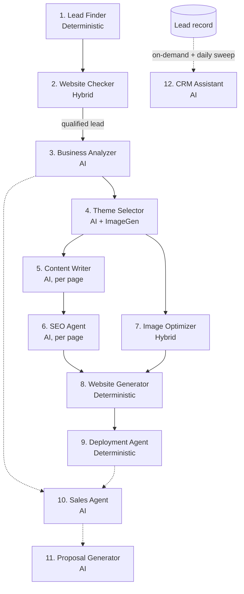
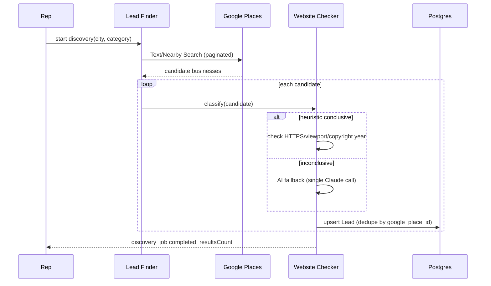
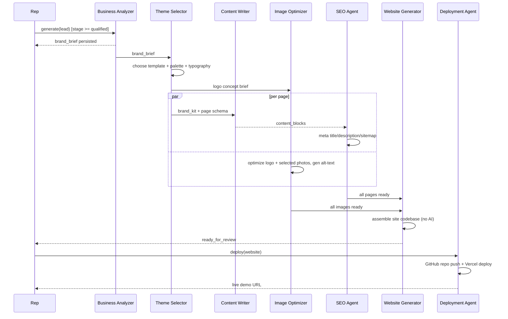
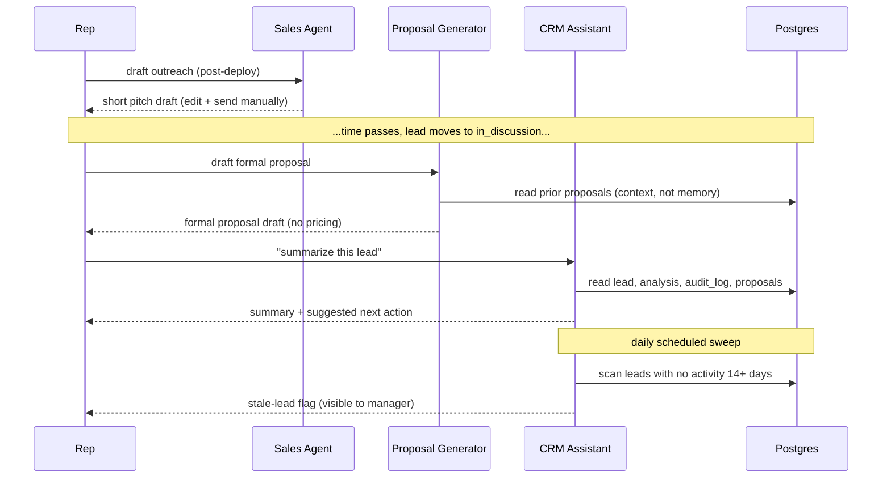

# AI Agents Architecture — Riznexia AI Sales Platform

**Status:** Draft — deep agent design deliverable
**Role:** AI Architect pass
**Last updated:** 2026-07-29

> **Scope note:** Deepens Doc 09 and Doc 16 §7 into a full catalog of 12 named agents (per your list) plus a Future Agents section. Three of these — Lead Finder, Website Generator, Deployment — are **deliberately not LLM calls**; they're "agents" in the pipeline/orchestration sense (a bounded task with defined inputs/outputs/retries), not in the sense of invoking a model. That distinction is called out per-agent rather than silently glossed over, since it's a real architectural decision (Doc 09 §2) carried forward here. No implementation code, per instruction.
>
> **Doc-sync note (2026-07-29):** No agents in this catalog are built yet (all land in Modules M6–M10). Two field references corrected: Module M2 split `places_data`/`category` off `lead` onto a new `business` entity — see DECISIONS.md D-018, D-029.

---

## 1. Cross-Cutting Design Principles

These apply to every agent below; each agent's table only calls out where it deviates.

**Memory Model — stateless by design.** No agent holds conversational memory across calls. "Memory" always means _the database, read fresh at invocation time_ — `lead`, `business_analysis`, `website`, `audit_log`, etc. (Doc 18). This is deliberate: it makes every call replayable and auditable (any output is reconstructible from its DB inputs + prompt version, Doc 16 §7), and it's what makes Trigger.dev's idempotency guarantee (Doc 16 §9) actually hold — a retried task must produce the same result given the same DB state, which requires no hidden state riding along in a chat history.

**Retry philosophy.** Transport-level retries (network/5xx/timeout) are separate from quality-escalation retries. Every AI-calling agent gets: 1 same-model retry on schema-validation failure, then at most 1 escalation to Claude Opus 5 before surfacing failure (Doc 09 §3) — never more, to bound cost. Deterministic agents (Lead Finder, Website Generator, Deployment) retry only transient transport errors; there's no "quality" to escalate.

**Fallback philosophy.** Every agent defines a degrade-gracefully path _except_ where a degraded output would actively mislead (e.g., Proposal Generator has no auto-fallback — a bad formal document is worse than none). Where fallback exists, it's stated per-agent below, not left implicit.

**Logging.** Structured JSON (`packages/logger`, Doc 16 §14), correlation ID tied to the owning `generation_job`/`discovery_job` row, agent name, stage, duration. AI agents additionally log token usage and prompt version. Full prompt/response content logs at `debug` only, never `info` — no PII/business content in default logs (Security Strategy §3, §7).

**Monitoring.** Per-agent success/failure rate and p50/p95 latency via Trigger.dev (Doc 16 §13); cost-bearing agents also get a line on the internal Cost dashboard (Doc 17 §14). Alert threshold: failure rate >10% over a rolling hour pages the internal ops channel (Doc 14 §8).

## 2. Agent Catalog

| #   | Agent              | Type                                  | Trigger                                                     |
| --- | ------------------ | ------------------------------------- | ----------------------------------------------------------- |
| 1   | Lead Finder        | Deterministic                         | `POST /discovery-jobs`                                      |
| 2   | Website Checker    | Hybrid (heuristic + rare AI fallback) | Per-candidate, within a discovery job                       |
| 3   | Business Analyzer  | AI                                    | Lead reaches Qualified / manual re-run                      |
| 4   | Theme Selector     | AI + delegates image-gen              | After Business Analyzer                                     |
| 5   | Content Writer     | AI                                    | After Theme Selector                                        |
| 6   | SEO Agent          | AI                                    | After Content Writer, per page                              |
| 7   | Image Optimizer    | Hybrid (processing + AI alt-text)     | After Theme Selector's logo returns / per Places photo used |
| 8   | Website Generator  | Deterministic (no LLM, by design)     | After Content Writer + SEO + Image Optimizer complete       |
| 9   | Deployment Agent   | Deterministic                         | `POST /websites/{id}/deployments`                           |
| 10  | Sales Agent        | AI                                    | `POST /leads/{id}/proposals` (rep-initiated, early)         |
| 11  | Proposal Generator | AI                                    | Rep-initiated, lead at `in_discussion`+                     |
| 12  | CRM Assistant      | AI, on-demand                         | Rep-initiated + daily stale-lead sweep                      |

## 3. Pipeline Overview

Solid arrows are hard pipeline dependencies; dashed arrows are rep-initiated or scheduled, not blocking steps in the generation pipeline.

---

## 4. Agent 1 — Lead Finder

| Aspect           | Detail                                                                                                                                                                                         |
| ---------------- | ---------------------------------------------------------------------------------------------------------------------------------------------------------------------------------------------- |
| Responsibilities | Query Google Places (Text/Nearby Search) for a city + category; paginate up to a configured cap; normalize raw results into candidate business records; hand each candidate to Website Checker |
| Inputs           | `city`, `categories[]`, `radiusKm`, requesting rep id                                                                                                                                          |
| Outputs          | Candidate list: `placeId`, `name`, `address`, `category`, `rating`, `reviewCount`, `photos`, raw `website` field if present                                                                    |
| Prompt Strategy  | **N/A — no LLM call.** Discovery is a deterministic API query + pagination; this keeps the highest-volume, most-frequently-run step in the whole system AI-cost-free                           |
| Memory           | Stateless; no read beyond request params                                                                                                                                                       |
| Retries          | 3x exponential backoff on Places 5xx/timeout; no retry on 4xx                                                                                                                                  |
| Fallback         | Exhausted retries → `discovery_job.status = failed`, partial results from already-fetched pages are retained, not discarded                                                                    |
| Logging          | Search params, result count per page, Places quota consumed                                                                                                                                    |
| Monitoring       | Places API error rate; Places quota utilization (distinct from our internal $300 cost ceiling — Places has its own Google-side quota)                                                          |

## 5. Agent 2 — Website Checker

| Aspect           | Detail                                                                                                                                                                                                                                                                                                                                   |
| ---------------- | ---------------------------------------------------------------------------------------------------------------------------------------------------------------------------------------------------------------------------------------------------------------------------------------------------------------------------------------- |
| Responsibilities | Classify each candidate's `website_status` (none/outdated/present); dedupe against existing leads by `google_place_id`; persist qualifying candidates as `Lead` rows                                                                                                                                                                     |
| Inputs           | Candidate record from Lead Finder, including `website` URL if present                                                                                                                                                                                                                                                                    |
| Outputs          | `website_status` + confidence; a persisted `Lead` row for `none`/`outdated` candidates                                                                                                                                                                                                                                                   |
| Prompt Strategy  | **Heuristic first** (no site → `none`; site present → check HTTPS, mobile viewport meta, stale copyright year, response latency). **AI fallback, rare by design:** only when heuristic signals are contradictory, one lightweight Claude call reviews a text summary (title, meta tags, visible text snippet) and judges outdated-vs-not |
| Memory           | Stateless per candidate — no cross-candidate context                                                                                                                                                                                                                                                                                     |
| Retries          | 2x on page-fetch timeout; the AI-fallback tier itself doesn't retry (it's a bonus resolver, not required for correctness)                                                                                                                                                                                                                |
| Fallback         | Inconclusive after both tiers → classified `outdated` with `confidence: low`, surfaced to the rep to eyeball. **Fails open toward inclusion** — missing a real opportunity costs more than a rep spending 30 seconds ruling out a false positive                                                                                         |
| Logging          | Classification result, confidence, which tier resolved it                                                                                                                                                                                                                                                                                |
| Monitoring       | AI-fallback invocation rate — a rising rate signals the heuristic needs retuning, not that AI should become primary                                                                                                                                                                                                                      |

## 6. Agent 3 — Business Analyzer

| Aspect           | Detail                                                                                                                                                                                          |
| ---------------- | ----------------------------------------------------------------------------------------------------------------------------------------------------------------------------------------------- |
| Responsibilities | Synthesize reviews, rating, category, and photo metadata into a structured brand brief (tone, audience signals, strengths, what to avoid emphasizing)                                           |
| Inputs           | `business.places_data` (Module M2, DECISIONS.md D-018)                                                                                                                                          |
| Outputs          | `business_analysis` row (`brand_brief`, `sentiment_summary`), keyed to `business_id`                                                                                                            |
| Prompt Strategy  | Single-shot, structured-input-delimited (Doc 16 §7), versioned template; explicit instruction to never assert facts absent from input (Doc 09 §7)                                               |
| Memory           | Stateless — reads the latest `places_data` fresh, so re-running after a lead refresh naturally reflects new data                                                                                |
| Retries          | 1x same-model on validation failure, then 1x Opus escalation — max 3 attempts total                                                                                                             |
| Fallback         | Exhausted attempts → job `failed`; **no generic-brief fallback** — downstream generation stays blocked, since generic content is the exact failure mode this system exists to avoid (Doc 01 §6) |
| Logging          | Token usage, prompt version, per-attempt validation result                                                                                                                                      |
| Monitoring       | Escalation rate (Sonnet→Opus) — a cost/quality tuning signal over time                                                                                                                          |

## 7. Agent 4 — Theme Selector

| Aspect           | Detail                                                                                                                                                                                                 |
| ---------------- | ------------------------------------------------------------------------------------------------------------------------------------------------------------------------------------------------------ |
| Responsibilities | Choose `template_key` (and thematic variant, if the category has more than one); generate palette + typography pairing; produce a logo concept brief and request the asset from the image-gen provider |
| Inputs           | `business_analysis.brand_brief`, `business.category` (Module M2 split `category`/`city`/`address`/Places fields onto `business`; `lead` now holds pipeline state only — DECISIONS.md D-018)            |
| Outputs          | `website.template_key`, `brand_kit.palette`, `brand_kit.typography`, logo concept brief handed to Image Optimizer once the raw asset returns                                                           |
| Prompt Strategy  | Single-shot; template/variant choice is constrained to a whitelisted enum of built templates — the model can never select a template that doesn't exist (Doc 09 §5 applied specifically here)          |
| Memory           | Stateless                                                                                                                                                                                              |
| Retries          | 1x validation retry, 1x Opus escalation                                                                                                                                                                |
| Fallback         | Palette fails WCAG contrast validation after retries → falls back to a pre-approved default palette for that category, rather than blocking the whole pipeline on a color edge case                    |
| Logging          | Chosen template/variant, palette values, contrast-check result                                                                                                                                         |
| Monitoring       | Default-palette-fallback rate — rising rate signals the palette prompt needs tuning                                                                                                                    |

## 8. Agent 5 — Content Writer

| Aspect           | Detail                                                                                                                                                                                                                                                                                   |
| ---------------- | ---------------------------------------------------------------------------------------------------------------------------------------------------------------------------------------------------------------------------------------------------------------------------------------- |
| Responsibilities | Generate structured content blocks (headlines, body copy, CTAs) for every page in the chosen template's page schema                                                                                                                                                                      |
| Inputs           | `brand_brief`, `brand_kit`, template's page schema                                                                                                                                                                                                                                       |
| Outputs          | `website_page.content_blocks`, one row per page                                                                                                                                                                                                                                          |
| Prompt Strategy  | **One call per page**, not one call for the whole site — smaller, independently retryable outputs. Pages don't read each other's freshly-generated content (avoids compounding hallucination); cross-page consistency comes from the shared `brand_brief` input, not page-to-page memory |
| Memory           | Stateless per page call                                                                                                                                                                                                                                                                  |
| Retries          | Per-page: 1x validation retry, 1x Opus escalation. A failure on one page never blocks the others — they're independent tasks                                                                                                                                                             |
| Fallback         | A page that exhausts retries is marked `failed` on its `generation_job` and surfaced as "needs manual regeneration"; the rest of the site still completes                                                                                                                                |
| Logging          | Per-page token usage, validation results                                                                                                                                                                                                                                                 |
| Monitoring       | Per-page and per-category failure rate — a high per-category rate signals that category's page schema is poorly specified for the model                                                                                                                                                  |

## 9. Agent 6 — SEO Agent

| Aspect           | Detail                                                                                                                                         |
| ---------------- | ---------------------------------------------------------------------------------------------------------------------------------------------- |
| Responsibilities | Generate meta title/description, validate heading structure, produce sitemap entries                                                           |
| Inputs           | `website_page.content_blocks`                                                                                                                  |
| Outputs          | `seo_meta_title`, `seo_meta_description`, sitemap entry                                                                                        |
| Prompt Strategy  | Single-shot per page; length constraints (title ≤60 chars, description ≤160 chars) enforced by schema validation, not prompt instruction alone |
| Memory           | Stateless                                                                                                                                      |
| Retries          | 1x validation retry (length/format), 1x Opus escalation                                                                                        |
| Fallback         | Exhausted retries → deterministic template fallback (`"{businessName}                                                                          | {category} in {city}"`) — a page never ships with missing SEO metadata, even degraded |
| Logging          | Generated field lengths, validation result, whether fallback template fired                                                                    |
| Monitoring       | Fallback-usage rate                                                                                                                            |

## 10. Agent 7 — Image Optimizer

| Aspect           | Detail                                                                                                                                                                               |
| ---------------- | ------------------------------------------------------------------------------------------------------------------------------------------------------------------------------------ |
| Responsibilities | Resize/compress/convert images to web-optimized formats (WebP), enforce max dimensions/file size, generate accessible alt-text, upload to R2 per the naming convention (Doc 16 §11)  |
| Inputs           | Raw image (image-gen output or a selected Places photo) + usage context (which page/section)                                                                                         |
| Outputs          | Optimized asset in R2 + `alt_text` stored alongside the reference                                                                                                                    |
| Prompt Strategy  | Alt-text is a single-shot, vision-capable Claude call per image, given the image plus its usage context; output is schema-length-capped to one short sentence                        |
| Memory           | Stateless per image                                                                                                                                                                  |
| Retries          | Processing (resize/format): 3x. Alt-text AI call: 1x, **no Opus escalation** — alt-text is low-stakes enough not to justify the cost                                                 |
| Fallback         | Alt-text generation fails → deterministic template fallback (`"{businessName} — {category}"`) — alt-text is never left empty (accessibility requirement, Doc 17 §17, non-negotiable) |
| Logging          | Compression ratio (original vs. optimized size), alt-text source (AI vs. fallback)                                                                                                   |
| Monitoring       | Average compression ratio (R2 storage/egress cost signal), alt-text fallback rate                                                                                                    |

## 11. Agent 8 — Website Generator

| Aspect           | Detail                                                                                                                                                                                                                                                                                         |
| ---------------- | ---------------------------------------------------------------------------------------------------------------------------------------------------------------------------------------------------------------------------------------------------------------------------------------------- |
| Responsibilities | Assemble template + brand_kit tokens + page content_blocks + optimized image references into a deployable site codebase                                                                                                                                                                        |
| Inputs           | `website`, `brand_kit`, all `website_page` rows, optimized image URLs                                                                                                                                                                                                                          |
| Outputs          | A rendered site codebase, handed to the Deployment Agent                                                                                                                                                                                                                                       |
| Prompt Strategy  | **N/A — no LLM call, by design** (Doc 09 §2). AI supplies content/tokens upstream; this agent only assembles them through fixed template components, which bounds output quality/consistency and keeps generated sites maintainable — an AI-authored arbitrary-code path is explicitly avoided |
| Memory           | Stateless; reads the full current DB state fresh each run, so a regenerate/redeploy always reflects the latest content                                                                                                                                                                         |
| Retries          | 3x on transient build-tooling errors                                                                                                                                                                                                                                                           |
| Fallback         | Build failure after retries → `website.status = failed` with the build error surfaced — this is a build-tooling issue, not a quality issue, so no degraded fallback applies (fixed or it isn't)                                                                                                |
| Logging          | Build duration, output size, template/version used                                                                                                                                                                                                                                             |
| Monitoring       | Build failure rate — a rising rate signals a template regression, routed to engineering, not to AI-prompt tuning                                                                                                                                                                               |

## 12. Agent 9 — Deployment Agent

| Aspect           | Detail                                                                                                                                                                        |
| ---------------- | ----------------------------------------------------------------------------------------------------------------------------------------------------------------------------- |
| Responsibilities | Create/update the demo's GitHub repo (Riznexia-owned), push the built codebase, create/update its Vercel project, trigger deployment, receive the status webhook              |
| Inputs           | Built site codebase, website id (for the repo/project naming convention, Doc 04 §6)                                                                                           |
| Outputs          | `deployment` row (`github_repo_url`, `vercel_project_id`, `live_url`, `status`)                                                                                               |
| Prompt Strategy  | N/A — no LLM call                                                                                                                                                             |
| Memory           | Stateless; reuses the same repo/project across redeploys (update, not recreate)                                                                                               |
| Retries          | 3x exponential backoff, longer max backoff than other agents given Vercel build times (Doc 16 §9)                                                                             |
| Fallback         | Exhausted retries → `deployment.status = failed`; a **previous successful deployment stays live and unaffected** — a failed redeploy never takes down an already-working demo |
| Logging          | GitHub API response codes, Vercel build id, webhook payloads                                                                                                                  |
| Monitoring       | Deployment success rate, average time-to-live (ties to the <5 min end-to-end target, PRD NFR)                                                                                 |

## 13. Agent 10 — Sales Agent

| Aspect           | Detail                                                                                                                                              |
| ---------------- | --------------------------------------------------------------------------------------------------------------------------------------------------- |
| Responsibilities | Draft a short, personalized opening outreach message referencing the business's specific strengths and the live demo URL                            |
| Inputs           | `brand_brief`, `deployment.live_url` (if available), lead contact context                                                                           |
| Outputs          | `sales_proposal` row (`draft_content`, `status: draft`)                                                                                             |
| Prompt Strategy  | Single-shot; tone calibrated as a low-pressure opener, not a hard sell; explicitly instructed never to fabricate a prior relationship/contact       |
| Memory           | Stateless — each request is independent, so a rep can re-draft any time                                                                             |
| Retries          | 1x validation retry (length, no placeholder leakage)                                                                                                |
| Fallback         | Exhausted retries → surfaced as failed, rep drafts manually — the pre-tool baseline, since there's no auto-send to fall back to anyway (PRD FR-8.2) |
| Logging          | Token usage, whether a live demo URL was available at draft time                                                                                    |
| Monitoring       | Draft-request volume — an adoption signal for this specific feature                                                                                 |

## 14. Agent 11 — Proposal Generator

| Aspect           | Detail                                                                                                                                                                                                                                                                                |
| ---------------- | ------------------------------------------------------------------------------------------------------------------------------------------------------------------------------------------------------------------------------------------------------------------------------------- |
| Responsibilities | Draft a longer-form, more formal proposal — recap of findings, what was built, suggested next steps. **Never includes pricing** — no billing surface exists (BRD explicit non-goal), and pricing language is deliberately excluded from AI-drafted content, left to the rep if needed |
| Inputs           | `brand_brief`, `website` + `deployment` details, prior `sales_proposal` rows for the lead (as read-only context)                                                                                                                                                                      |
| Outputs          | `sales_proposal` row — longer, structurally distinct from a Sales Agent draft, same table                                                                                                                                                                                             |
| Prompt Strategy  | Single-shot, structured sections (recap / what we built / next steps); explicit instruction to omit pricing/commercial terms entirely                                                                                                                                                 |
| Memory           | Stateless per call, but the prompt includes prior proposal drafts for the lead as context (a DB read, not model memory) so a second proposal doesn't contradict the first                                                                                                             |
| Retries          | 1x validation retry (section-presence check), 1x Opus escalation given the longer-form reasoning task                                                                                                                                                                                 |
| Fallback         | Exhausted retries → surfaced as failed, **no degraded auto-fallback** — a bad formal proposal is worse than none, unlike the Sales Agent's lower-stakes case                                                                                                                          |
| Logging          | Token usage, section-presence validation results                                                                                                                                                                                                                                      |
| Monitoring       | Escalation rate; draft-to-edit ratio (how much a rep changes before sending — a quality signal over time)                                                                                                                                                                             |

## 15. Agent 12 — CRM Assistant

| Aspect           | Detail                                                                                                                                                                                                                             |
| ---------------- | ---------------------------------------------------------------------------------------------------------------------------------------------------------------------------------------------------------------------------------- |
| Responsibilities | Summarize a lead's activity/notes into a short brief for a rep picking it up fresh; suggest a next-best-action given stage + time-in-stage; flag leads with no activity in 14+ days (daily scheduled sweep) for manager visibility |
| Inputs           | `lead` (notes, stage, timestamps), `business_analysis`, `audit_log` entries for the lead, related `sales_proposal` history                                                                                                         |
| Outputs          | A summary string surfaced in the Lead Detail UI (not persisted as its own table — regenerated on demand); a stale-lead flag/notification from the sweep                                                                            |
| Prompt Strategy  | Single-shot summarization. This agent is the clearest instance of the DB-as-memory pattern (§1) — its entire job is synthesizing persisted history, not generating new content                                                     |
| Memory           | Explicit DB-as-memory — reads everything persisted about the lead fresh on each invocation                                                                                                                                         |
| Retries          | 1x on transient failure                                                                                                                                                                                                            |
| Fallback         | Failure → the UI shows the raw activity timeline instead of an AI summary; never blocks the rep from seeing underlying data                                                                                                        |
| Logging          | Token usage — tracked more closely here since this is the most frequently rep-invoked on-demand agent                                                                                                                              |
| Monitoring       | Invocation volume vs. cost (BRD BR-7) — an on-demand, rep-triggerable agent is the one most exposed to overuse without a cap, so it gets its own per-rep daily quota (Doc 16 §10)                                                  |

---

## 16. Detailed Sequence Diagrams

### 16.1 Discovery Phase (Lead Finder → Website Checker)

### 16.2 Generation + Deployment Phase

### 16.3 Outreach + CRM Assistant

---

## 17. Future Agents (Post-MVP)

| Agent                     | Purpose                                                                  | Why deferred                                                                                                                                           |
| ------------------------- | ------------------------------------------------------------------------ | ------------------------------------------------------------------------------------------------------------------------------------------------------ |
| Competitor Analysis Agent | Analyze nearby competitor websites for positioning contrast in the pitch | Needs a clear external-site-scraping data-source decision first                                                                                        |
| Lead Scoring Agent        | ML-based lead prioritization                                             | Needs real usage data — feeds the `lead_scores` future table (Doc 18 §10)                                                                              |
| Follow-Up Sequencer Agent | Draft a multi-touch outreach sequence over time                          | Current agents are deliberately single-shot; sequencing reopens the autonomous-send boundary question (PRD FR-8.2) that's intentionally closed for MVP |
| Feedback Analysis Agent   | Process prospect reactions to a demo                                     | Deferred until the `demo_feedback` future table's non-employee write-path trust boundary (Doc 18 §10) is decided                                       |
| Voice/Call Summary Agent  | Transcribe/summarize sales calls into CRM notes                          | Needs a call-recording integration decision first                                                                                                      |

---

**AI Agent architecture complete — deepens Doc 09, feeds Phase 4 (Backend) and Phase 6 (AI Agents) of the roadmap. Still awaiting your go-ahead to begin implementation.**
