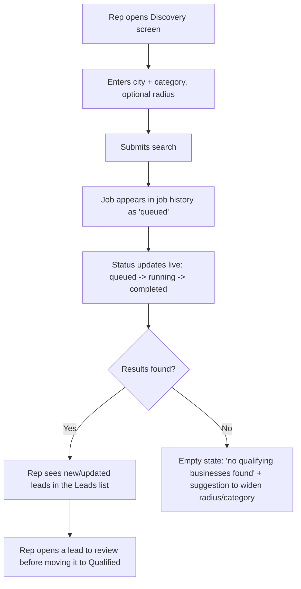
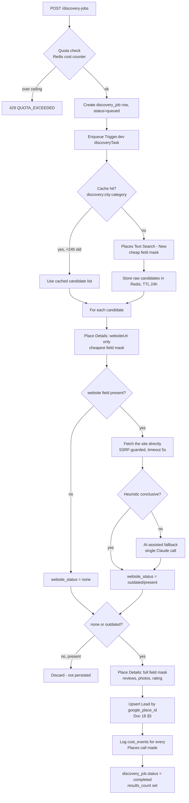
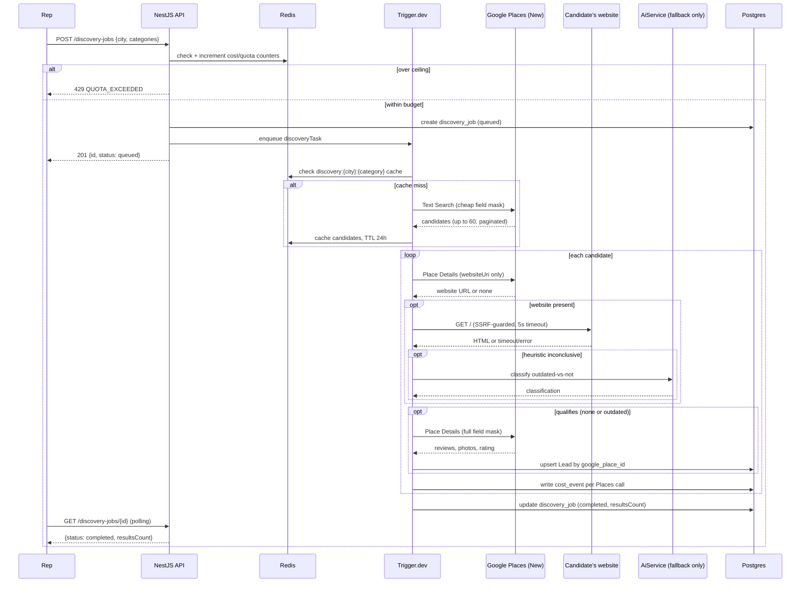

# Module M1 Design Review — Lead Discovery

**Status:** Draft — pre-implementation design review
**Last updated:** 2026-07-27

> **Scope note:** This is the design review for Module M1 only (Doc 21). It consolidates and deepens what's already specified in Docs 03, 16, 18, 19, 20 for this module specifically, and resolves a few things that were previously left at "principle" level (notably the Places API cost-tiering strategy and the website-fetch step's SSRF exposure, §9 and §16). No implementation code — design only, per instruction.

---

## 1. Module Objective

Let a Riznexia rep run a discovery search (city + category) and get back real, qualified leads — businesses with no website or a clearly outdated one — persisted and ready to enter the pipeline. This is the entry point of the entire product (Doc 01): every downstream module (AI Business Analyzer, Website Generator, Deployment, Sales CRM) operates on leads this module produces. Matches Doc 21 M1's Definition of Done: _PRD FR-1.1–FR-1.6 pass; a rep runs a real search against a live city and sees qualified leads appear._

## 2. Functional Requirements

Restated from PRD §3.1, with the two implementation-relevant additions this review surfaces (FR-1.7, FR-1.8):

| ID             | Requirement                                                                                                                                                                                                                |
| -------------- | -------------------------------------------------------------------------------------------------------------------------------------------------------------------------------------------------------------------------- |
| FR-1.1         | Rep can start a discovery search by city (or geo radius) + one or more business categories                                                                                                                                 |
| FR-1.2         | System queries Google Places and retrieves business name, address, category, rating, review count, photos, website field (if any)                                                                                          |
| FR-1.3         | System classifies each result as `none` / `present` (excluded by default) / `outdated`                                                                                                                                     |
| FR-1.4         | Qualifying businesses are stored as Leads                                                                                                                                                                                  |
| FR-1.5         | Duplicate leads (same Google Place ID) are not re-created on repeat searches — the existing lead is refreshed instead                                                                                                      |
| FR-1.6         | Rep can see discovery job status/result count while a search runs (async job)                                                                                                                                              |
| FR-1.7 _(new)_ | A lead's `places_data` and `website_status` are refreshed, not just deduplicated-and-ignored, when the same business resurfaces in a later search — a business can go from "has a site" to "site down" between searches    |
| FR-1.8 _(new)_ | A discovery job that partially fails (e.g., page 2 of 3 fails) persists the leads it already found rather than discarding everything — matches Doc 20 §4's fallback policy, made explicit as a functional requirement here |

## 3. Non-Functional Requirements

| Concern      | Target                                                                                                                                                                                                                                                                                                           |
| ------------ | ---------------------------------------------------------------------------------------------------------------------------------------------------------------------------------------------------------------------------------------------------------------------------------------------------------------- |
| Latency      | A single city/category search (up to 60 candidates, Google's per-request cap) completes within **2 minutes** end-to-end (search + per-candidate website check). This is looser than the generation pipeline's 5-minute target (PRD NFR) because it's bounded by external site-fetch latency, not our own compute |
| Cost         | Every discovery job's Google Places spend is logged to `cost_events` (Doc 18 §3) and counted against the $300/month ceiling (Doc 04 §10) before it starts, not just after                                                                                                                                        |
| Availability | Discovery degrades gracefully, not totally, on partial Places/site-fetch failure (FR-1.8)                                                                                                                                                                                                                        |
| Concurrency  | Multiple reps can run discovery simultaneously without one job starving another — bounded by the per-task concurrency cap (Doc 16 §9), not unbounded                                                                                                                                                             |
| Idempotency  | Re-running the same city+category search is cheap (cache hit) and never creates duplicate leads (unique constraint + upsert, Doc 18 §5)                                                                                                                                                                          |

## 4. User Flow



Matches the Discovery screen wireframe (Doc 17 §9) — no new UI surface implied by this design.

## 5. Technical Flow



Key design decision made explicit here: **the website field-mask fetch is split into a cheap pass (website URL only) and an expensive pass (full reviews/photos, only for candidates that already qualify)** — §9 explains why.

## 6. Sequence Diagram



## 7. Database Tables Involved

**No new tables or migrations required** — `discovery_job` and `lead` were already fully designed and built during initial project setup (Doc 18 §8, `packages/db/prisma/schema.prisma`). This module is pure application logic against an existing schema. (Note: Module M2 — Database & Core Domain Models later restructured this schema, splitting `Business` out of `Lead`; this section reflects the schema as it stood at M1's design-review time, not the current state — see docs/18-database-architecture.md and DECISIONS.md D-018 for what changed.)

| Table           | Role in this module                                                                                                   |
| --------------- | --------------------------------------------------------------------------------------------------------------------- |
| `discovery_job` | One row per search; `status`, `results_count` updated as the task progresses                                          |
| `lead`          | Upserted per qualifying candidate; `discovery_job_id` links back (nullable, `SET NULL` on job deletion per Doc 18 §3) |
| `cost_event`    | One row per Places API call (search + both Details tiers), `event_type: 'google_places'`                              |

Relevant existing indexes already cover this module's query patterns: `leads_google_place_id_key` (dedupe), `discovery_jobs(created_by)` (job history per rep).

## 8. API Endpoints

All already specified in Doc 19 §5 (OpenAPI) — this module _implements_ them, it doesn't design new surface. Scope boundary vs. Module M4 (Lead Management APIs) — renumbered 2026-07-28, DECISIONS.md D-022; this was "Module M2 (Lead Pipeline/CRM)" at design-review time:

| Endpoint                                     | In scope for M1?                          |
| -------------------------------------------- | ----------------------------------------- |
| `POST /discovery-jobs`                       | Yes — core deliverable                    |
| `GET /discovery-jobs`                        | Yes                                       |
| `GET /discovery-jobs/{id}`                   | Yes                                       |
| `GET /leads` (list, read-only)               | Yes — needed to see results land          |
| `GET /leads/{id}` (read-only)                | Yes                                       |
| `PATCH /leads/{id}` (stage/assignment/notes) | **No — Module M4**                        |
| `DELETE /leads/{id}`                         | **No — Module M4**                        |
| `/leads/{id}/business`                       | **No — Module M6** (AI Business Analyzer) |

## 9. Google Places API Integration Strategy

**API version:** Places API (New), not the legacy Places API — field-mask-based billing gives explicit cost control, which the legacy API's fixed-field responses don't (Doc ground rule: latest stable technology).

**Three-tier fetch strategy** (the key design decision this review adds beyond Doc 20's summary):

1. **Search tier** — Text Search (New) with a minimal field mask (`places.id`, `places.displayName`, `places.formattedAddress`, `places.types`, `places.primaryType`). Cheapest tier. Paginated via `pageToken`, up to 3 pages / 60 results per Google's cap, with the ~2s inter-page delay Google's API requires before a `pageToken` becomes valid.
2. **Website-check tier** — Place Details (New) called **per candidate**, field mask limited to `websiteUri` only. This is the cheapest Details tier and is the _only_ Details call made for candidates that turn out to already have a present, non-outdated website — avoiding the more expensive tier for the ~majority of candidates that get excluded anyway.
3. **Full-data tier** — Place Details (New) with the fuller field mask (`reviews`, `photos`, `rating`, `userRatingCount`) — called **only** for candidates that already passed the `none`/`outdated` classification. This is deliberately the last step, not bundled into tier 2, specifically to avoid paying for review/photo data on businesses that get discarded.

**Category mapping:** our category taxonomy (Doc 06 §"category") maps to Places' `type`/`primaryType` enum via a static lookup table (e.g., our `"restaurant"` → Places `restaurant`, `"salon"` → `beauty_salon`) maintained in the discovery module, not hardcoded inline in the adapter — new categories are a data change, not a code change.

**Exact SKU/pricing tiers should be verified against Google's current Places API pricing page at implementation time** — this design fixes the _strategy_ (cheap-then-expensive tiering) which holds regardless of Google's exact current price points, but I'm not asserting precise dollar figures here since Places API pricing has changed materially across versions and I don't want to bake in a number I can't verify as current.

**Pagination and rate shape:** within a single discovery job, per-candidate Details calls are issued with a **bounded concurrency** (e.g., 5 in flight at once — tuned during implementation against observed Google rate-limit behavior), not fired all at once — this is the QPS-respecting half of §12's rate limiting strategy.

## 10. Error Handling Strategy

| Source                         | Failure mode                                 | Handling                                                                                                                                                                                                            |
| ------------------------------ | -------------------------------------------- | ------------------------------------------------------------------------------------------------------------------------------------------------------------------------------------------------------------------- |
| Places Search                  | `RESOURCE_EXHAUSTED` (quota)                 | Map to `502 UPSTREAM_PROVIDER_ERROR`; retryable (§11)                                                                                                                                                               |
| Places Search                  | `INVALID_ARGUMENT` (bad city/category)       | Map to `400 VALIDATION_ERROR`; **not** retryable — surfaces immediately to the rep                                                                                                                                  |
| Places Search                  | Zero results                                 | Not an error — `discovery_job` completes with `resultsCount: 0`; UI shows the empty state (§4)                                                                                                                      |
| Place Details (either tier)    | Timeout/5xx                                  | Retryable (§11); failure on one candidate does not fail the whole job (Doc 20 §4 fallback)                                                                                                                          |
| Website fetch                  | Timeout, connection refused, TLS error       | Treated as a heuristic signal, not a hard failure — Doc 20 §5 already established "inconclusive → `outdated`, low confidence" as the fallback; a dead site is itself evidence of an outdated/abandoned web presence |
| Website fetch                  | Non-HTML response (PDF, redirect loop, etc.) | Same fallback path — classified `outdated`, low confidence, flagged for rep review                                                                                                                                  |
| Google API key invalid/revoked | `PERMISSION_DENIED`                          | Not retryable — job fails immediately, alerts ops (this is a configuration problem, not a transient one)                                                                                                            |

All error codes map into the existing catalog (Doc 19 §4) — no new codes needed beyond what's already defined (`UPSTREAM_PROVIDER_ERROR`, `VALIDATION_ERROR`, `QUOTA_EXCEEDED`).

## 11. Retry Strategy

Two distinct retry domains, per Doc 16 §9's transport-vs-quality distinction (here it's transport-vs-heuristic):

- **Places API calls:** 3x exponential backoff on `RESOURCE_EXHAUSTED`/5xx/timeout, per Trigger.dev task config. No retry on `INVALID_ARGUMENT`/`PERMISSION_DENIED` (non-transient).
- **Website fetch:** 1x retry only (a dead site is unlikely to recover within a job's lifetime; more retries just burn time against a business's own server for no benefit — mildly discourteous to a third party we're not even in a relationship with).
- **AI fallback classification:** per Doc 20 §5 — no retry beyond the base call (it's a bonus resolver, not required for correctness; a failure here just leaves the heuristic's own inconclusive result standing).

## 12. Rate Limiting Strategy

Two layers, matching Doc 16 §10 and Doc 20 §1:

1. **Our own quota (cost governance):** per-rep and org-wide discovery-job creation is checked against the Redis-backed cost counter _before_ `discovery_job` is even created (§5, §6) — `429 QUOTA_EXCEEDED` if the org's $300/month ceiling (or its 80%-utilization warning threshold) is breached.
2. **Google's QPS limits:** bounded concurrency (§9) on outbound Places calls within a job, plus a global (cross-job) concurrency cap enforced at the Trigger.dev task-queue level (Doc 16 §9) so multiple reps' simultaneous discovery jobs don't collectively exceed Google's per-project QPS limit.

## 13. Caching Strategy

Extends Doc 16 §10 with the specific keys this module uses:

| Cache key                         | TTL    | Purpose                                                                                                                                                                                                                                                                                         |
| --------------------------------- | ------ | ----------------------------------------------------------------------------------------------------------------------------------------------------------------------------------------------------------------------------------------------------------------------------------------------- |
| `discovery:{city}:{category}`     | 24h    | Raw Search-tier candidate list — avoids re-paying for Search on a repeat query for the same city/category                                                                                                                                                                                       |
| `website-check:{google_place_id}` | 7 days | The website-check tier's classification result (`none`/`outdated`/`present` + confidence) — a business's site doesn't meaningfully change status within a week, and this avoids re-fetching the same site if the same `place_id` surfaces via a different search (e.g., overlapping categories) |
| `idem:{Idempotency-Key}`          | 1h     | Standard idempotency fast-path (Doc 19 §1), applies to `POST /discovery-jobs`                                                                                                                                                                                                                   |

The `website-check` cache is new relative to Doc 16 §10's original table — added here because §9's tiering strategy makes it clear the website-check step is the most expensive _repeatable_ cost driver, worth its own cache entry distinct from the coarser city/category cache.

## 14. Folder Structure

Within `apps/api/src/`, following the established module pattern (Doc 12 §2, Doc 16 §17):

```
discovery/
├── discovery.controller.ts       # POST/GET /discovery-jobs
├── discovery.service.ts          # orchestration, quota checks
├── discovery.tasks.ts            # Trigger.dev task definitions
├── discovery.module.ts
└── dto/
    ├── create-discovery-job.dto.ts
    └── discovery-job-response.dto.ts

leads/
├── leads.controller.ts           # GET /leads, GET /leads/{id} only in this module
├── leads.service.ts              # read + upsert-by-place-id (write path used by discovery.tasks.ts)
├── leads.module.ts
└── dto/
    └── lead-response.dto.ts

common/adapters/
├── places.adapter.ts             # tiered fetch strategy (§9), field-mask constants
└── website-fetch.adapter.ts      # SSRF-guarded HTTP client (§16)

common/classifiers/
└── website-status.classifier.ts  # heuristic (HTTPS/viewport/copyright-year) + AI-fallback trigger
```

`leads.module.ts` is intentionally thin here — full CRUD/mutation logic is Module M4's addition to the same module, not a separate one, since they share the underlying `Lead` domain (Doc 16 §3's bounded-context boundary is "Pipeline Context owns `lead`," which M1 writes into via `leads.service.ts`'s upsert method rather than owning a competing write path). (Note: `leads.service.ts`'s write path was itself reworked by Module M2 — see DECISIONS.md D-018 — the bounded-context boundary described here still holds, just via `ensureForBusiness` rather than the original `upsertByPlaceId`.)

## 15. Testing Strategy

Per Doc 13's layered approach, scoped to this module:

| Layer               | What's covered                                                                                                                                                                                                                                                                                               |
| ------------------- | ------------------------------------------------------------------------------------------------------------------------------------------------------------------------------------------------------------------------------------------------------------------------------------------------------------ |
| Unit                | `website-status.classifier.ts` heuristic against a fixture set of real-shaped HTML (HTTPS present/absent, viewport meta present/absent, stale/fresh copyright year) — no network calls; `places.adapter.ts`'s field-mask tiering logic (asserts tier-2 is never called for a `present`-classified candidate) |
| Integration         | `POST /discovery-jobs` end-to-end against a mocked Places adapter + mocked website-fetch adapter — asserts dedup-by-place-id, quota enforcement, partial-failure persistence (FR-1.8)                                                                                                                        |
| Contract            | `places.adapter.ts` against recorded real Places API (New) response fixtures — catches a Google API shape change before it reaches production                                                                                                                                                                |
| AI regression       | The website-check AI-fallback tier, against golden inconclusive-heuristic fixtures (Doc 13 §2 eval harness)                                                                                                                                                                                                  |
| E2E / staging smoke | One real, live discovery search against a known real city, run on a schedule (Doc 13 §4/§6) — not on every PR, given real Google API cost/latency                                                                                                                                                            |

Critical test scenarios specific to this module (additive to Doc 13 §4's list): quota-exceeded blocks job creation; re-running the same search doesn't duplicate leads; a website-fetch timeout doesn't fail the whole job; the SSRF guard (§16) actually rejects a crafted internal-IP `websiteUri`.

## 16. Security Considerations

- **SSRF via the website-fetch step (the significant new consideration this review surfaces):** `websiteUri` is attacker-_adjacent_ input — it's data returned by Google, but Google is reflecting whatever a business owner put in their Places listing, which is not a fully trusted source. Fetching it blind is a textbook SSRF vector (a malicious/compromised listing could point `websiteUri` at `http://169.254.169.254/...` or an internal service). Mitigation, enforced in `website-fetch.adapter.ts`:
  - Scheme allowlist: `http`/`https` only.
  - Resolve the hostname and reject private/link-local/loopback IP ranges (RFC 1918, `169.254.0.0/16`, `127.0.0.0/8`, etc.) before connecting — not just checking the URL string, since DNS can resolve a public-looking hostname to a private IP.
  - No following redirects to a different host without re-validating the new target against the same IP-range check.
  - Response size cap (e.g., 2MB) to prevent memory exhaustion from a malicious/misconfigured response.
  - Short timeout (5s per §10/§11).
- **Role/auth:** any authenticated employee can run discovery (org-wide access per Doc 16 §5) — no role restriction on this module's endpoints.
- **Input validation:** `city`/`categories` validated against a reasonable length/character-set bound before being interpolated into a Places API query — not for injection risk against Places itself (it's a structured API call, not string concatenation into SQL/shell), but to prevent a malformed or abusive input from generating a very expensive or very large query.
- **API key protection:** `GOOGLE_PLACES_API_KEY` is server-side only (`apps/api`'s env, Doc 15 §6) — never sent to or callable from `apps/web`.
- **Logging:** fetched website HTML is never logged at `info` level (Doc 16 §14) — only classification results and metadata; raw HTML only at `debug`, and truncated.
- **No PII concern:** business discovery data is business-public information (Doc 15 §7) — the only sensitive-_ish_ surface in this module is the SSRF exposure above, which is an infrastructure risk, not a data-privacy one.

## 17. Future Extensibility

| Future capability                                             | How this design doesn't block it                                                                                                                                           |
| ------------------------------------------------------------- | -------------------------------------------------------------------------------------------------------------------------------------------------------------------------- |
| Additional data sources (Yelp, Bing Places)                   | `places.adapter.ts` is already isolated behind an interface (Doc 16 §18 Adapter pattern) — a second source is a new adapter, not a rewrite                                 |
| ML-based lead scoring (Doc 18 §10 `lead_scores` future table) | This module's output (`places_data`, `cost_event` history) is exactly the training signal that future agent needs — nothing here needs to change to enable it              |
| Scheduled/bulk multi-city discovery                           | The `discovery_job` model and Trigger.dev task are already per-search; a scheduler is an additive trigger source (cron → same `POST /discovery-jobs` path), not a redesign |
| Full-text search over raw Places data                         | `leads_places_data_gin` index already provisioned in the schema (Doc 18 §4), unused until a search feature needs it                                                        |
| Competitor Analysis Agent (Doc 20 §17)                        | Would reuse this module's website-fetch adapter (already SSRF-guarded) rather than needing its own                                                                         |

---

**Design review complete. Awaiting your approval before implementing Module M1.**
